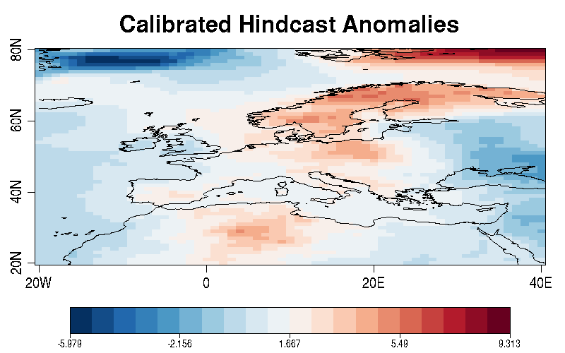
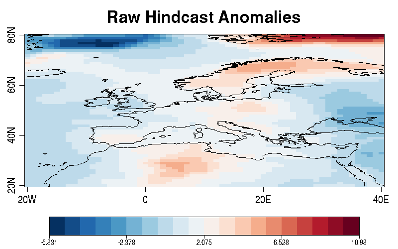
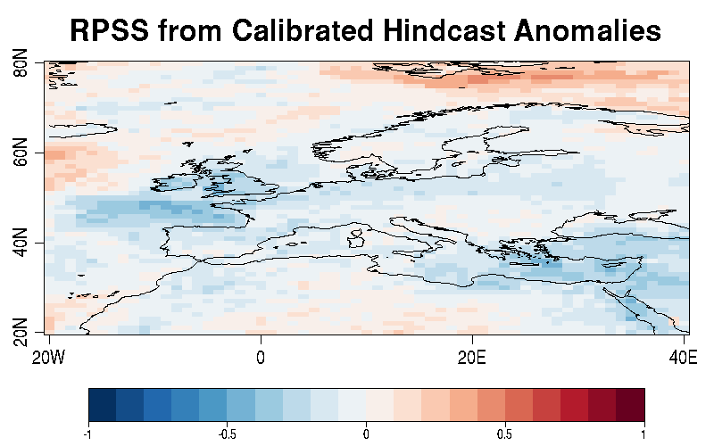
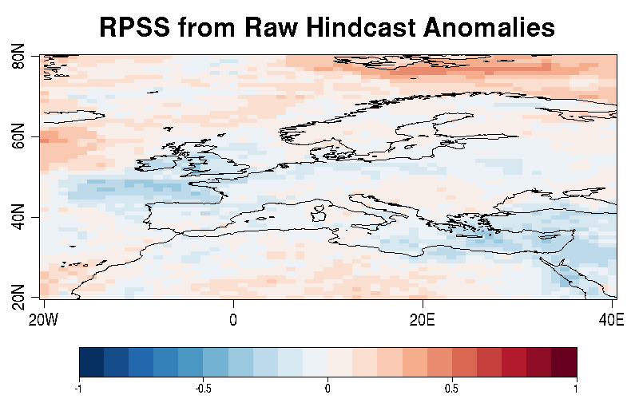

# Hands-on 2: Data assesment

**Goal:** Use CSTools and s2dv to perform a quality assesment of a climate model.

**Load packages**
```r
library(CSTools)
library(s2dv)
```

## 1. Load the data

In this section we will use the function **Start** to load the data. Then, we will transfrom the output **startR_array** to an **s2dv_cube** object in order that the data is easy to use within **CSTools** functions.

The **s2dv_cube** object is a structured list that contains the information needed to work with multidimensional arrays of data. Coordinates, dimensions, and metadata are neatly combined to allow for a more intuitive, concise, and less error-prone experience.

> **Note:** If you have already loaded the data with **Start**, go directly to section **b)**.

### a) Load the data

The following section is taken from [PATC 2023 startR tutorial](https://earth.bsc.es/gitlab/es/startR/-/blob/doc-bsc_training_2023/inst/doc/tutorial/PATC2023/handson_1-data-loading.md?ref_type=heads). The experiment data are Meteo-France System 7 from ECMWF, and the observation ones are ERA5 from ECMWF for near-surface temperature (short name: tas). We will focus on the Europe region (roughly 20W-40E, 20N-80N). The hindcast years are 1993 to 2016. 

```r
# Use this one if on workstation or nord3 (have access to /esarchive)
path_exp <- "/esarchive/exp/meteofrance/system7c3s/monthly_mean/$var$_f6h/$var$_$syear$.nc"
#----------------------------------------------------------------------
# Run these two lines if you're on Marenostrum4 and log in with training account
prefix <- '/gpfs/scratch/nct01/nct01001/d2_handson_R/'
path_exp <- paste0(prefix, path_exp)
#----------------------------------------------------------------------

sdate_hcst <- paste0(1993:2016, '1101')

hcst <- CST_Start(dat = path_exp,
                  var = 'tas',
                  syear = sdate_hcst,
                  ensemble = 'all',
                  time = 1:2,
                  latitude = startR::values(list(20, 80)),
                  latitude_reorder = startR::Sort(),
                  longitude = startR::values(list(-20, 40)),
                  longitude_reorder = startR::CircularSort(-180, 180),
                  transform = startR::CDORemapper,
                  transform_params = list(grid = 'r360x181', method = 'bilinear'),
                  transform_vars = c('latitude', 'longitude'),
                  synonims = list(latitude = c('lat', 'latitude'),
                                  longitude = c('lon', 'longitude')),
                  return_vars = list(time = 'syear',
                                     longitude = NULL, latitude = NULL),
                  retrieve = TRUE)

```

```r
# Save Dates dimensions
dates_dim <- dim(hcst$attrs$Dates)
# Adjust the day to the correct month
hcst$attrs$Dates <- hcst$attrs$Dates - lubridate::days(1)
# Add again Dates dimensions
dim(hcst$attrs$Dates) <- dates_dim

date_string <- format(hcst$attrs$Dates, '%Y%m')
sdate_obs <- array(date_string, dim = c(syear = 24, time = 2))
```

```r
path_obs <- '/esarchive/recon/ecmwf/era5/monthly_mean/$var$_f1h-r1440x721cds/$var$_$syear$.nc'
#----------------------------------------------------------------------
# Run these two lines if you're on Marenostrum4 and log in with training account
prefix <- '/gpfs/scratch/nct01/nct01001/d2_handson_R/'
path_obs <- paste0(prefix, path_obs)
#----------------------------------------------------------------------

obs <- CST_Start(dat = path_obs,
                 var = 'tas',
                 syear = sdate_obs,
                 split_multiselected_dims = TRUE,
                 latitude = startR::values(list(20, 80)),
                 latitude_reorder = startR::Sort(),
                 longitude = startR::values(list(-20, 40)),
                 longitude_reorder = startR::CircularSort(-180, 180),
                 transform = startR::CDORemapper,
                 transform_params = list(grid = 'r360x181', method = 'bilinear'),
                 transform_vars = c('latitude', 'longitude'),
                 synonims = list(syear = c('syear', 'sdate'),
                                 latitude = c('lat', 'latitude'),
                                 longitude = c('lon', 'longitude')),
                 return_vars = list(time = 'syear',
                                    longitude = NULL, latitude = NULL),
                 retrieve = TRUE)

```

### b) Create `s2dv_cube`:

Now we convert the **hindcast and observations data** (**startR_array**) into an **s2dv_cube** object with the function **as.s2dv_cube** from **CSTools** package:

```r
hcst <- as.s2dv_cube(hcst)
obs <- as.s2dv_cube(obs)
```
By printing the object, we can see the object structure. The first level elements are: 
- **Data**: A multidimensional array containing the data
- **Dimensions**: A vector with the data dimensions.
- **Coordinates**: A list with vector coordinates.
- **Attributes**: A list containing the metadata. 

```r
> hcst
's2dv_cube'
Data          [ 294.975204467773, 295.99658203125, 296.999153137207, 296.874618530273, 297.662521362305, 297.113525390625, 296.145011901855, 295.981201171875 ... ] 
Dimensions    ( dat = 1, var = 1, syear = 24, ensemble = 25, time = 2, latitude = 61, longitude = 61 ) 
Coordinates  
 * dat : dat1 
 * var : tas 
 * syear : 19931101, 19941101, 19951101, 19961101, 19971101, 19981101, 19991101, 20001101, 20011101, 20021101, 20031101, 20041101, 20051101, 20061101, 20071101, 20081101, 20091101, 20101101, 20111101, 20121101, 20131101, 20141101, 20151101, 20161101 
   ensemble : 1, 2, 3, 4, 5, 6, 7, 8, 9, 10, 11, 12, 13, 14, 15, 16, 17, 18, 19, 20, 21, 22, 23, 24, 25 
   time : 1, 2 
 * latitude : 20, 21, 22, 23, 24, 25, 26, 27, 28, 29, 30, 31, 32, 33, 34, 35, 36, 37, 38, 39, 40, 41, 42, 43, 44, 45, 46, 47, 48, 49, 50, 51, 52, 53, 54, 55, 56, 57, 58, 59, 60, 61, 62, 63, 64, 65, 66, 67, 68, 69, 70, 71, 72, 73, 74, 75, 76, 77, 78, 79, 80 
 * longitude : -20, -19, -18, -17, -16, -15, -14, -13, -12, -11, -10, -9, -8, -7, -6, -5, -4, -3, -2, -1, 0, 1, 2, 3, 4, 5, 6, 7, 8, 9, 10, 11, 12, 13, 14, 15, 16, 17, 18, 19, 20, 21, 22, 23, 24, 25, 26, 27, 28, 29, 30, 31, 32, 33, 34, 35, 36, 37, 38, 39, 40 
Attributes   
   Dates  : 1993-11-30 1994-11-30 1995-11-30 1996-11-30 1997-11-30 ... 
   varName  : tas 
   metadata :  
      time 
        other : class, tzone 
      longitude 
        other : dim 
      latitude 
        other : dim 
      tas 
        units : K 
        long name : 2 metre temperature 
        other : prec, dim, unlim, make_missing_value, missval, hasAddOffset, hasScaleFact, code, table 
   Datasets  : dat1 
   when  : 2023-10-26 14:43:30 
   source_files  : /esarchive/exp/meteofrance/system7c3s/monthly_mean/tas_f6h/tas_19931101.nc ... 
   load_parameters  : 
       ( dat1 )  : dat = dat1, var = tas, syear = 19931101 ... 
       ... 
```
> **Note:** An **s2dv_cube** object is an structured list in base R. To acces the elements, you need to use the `$` operator (e.g. `hcst$data`, `hcst$dims`, `hcst$coords`, `hcst$attrs`, ...)

#### Exercise 1
**Goal:** To find **s2dv_cube** information of **hindcast** data.

1. What type of object is an **s2dv_cube** in base R?  
```r
class(hcst)
# "s2dv_cube"
typeof(hcst)
# "list"
```
2. What type of object is the element `hcst$data` (common language)? Use the function **dim()** and **typeof()** to check `hcst$data`:
```r
typeof(hcst$data) # base type
# [1] "double"
dim(hcst$data) # dimensions
#   dat       var     syear  ensemble      time  latitude longitude 
#     1         1        24        25         2        61        61

# Answer: Multi-dimensional array / N-dimensional array / Tensor.
```
3. What are the **time dimensions** of the **hindcast** data? The Dates of an **s2dv_cube** can be found in element: `hcst$attrs$Dates`. 
```r
dim(hcst$attrs$Dates)
# syear  time 
#   24     2 
```
4. What are the coordinates names in the **hindcast**? Use the function **names()** to check. The coordinates in the  **s2dv_cube** are stored in element `hcst$coords`.
```r
names(hcst$coords)
# [1] "dat"       "var"       "syear"     "ensemble"  "time"      "latitude" 
# [7] "longitude"
```
5. In which **latitude** and **longitude** we have loaded the data? 
```r
hcst$coords$lat
# latitude: 20 21 22 23 24 25 26 27 28 29 30 31 32 33 34 35 36 37 38 39 40 41 42 43 44
# [26] 45 46 47 48 49 50 51 52 53 54 55 56 57 58 59 60 61 62 63 64 65 66 67 68 69
# [51] 70 71 72 73 74 75 76 77 78 79 80

hcst$coords$lon
#  [1] -20 -19 -18 -17 -16 -15 -14 -13 -12 -11 -10  -9  -8  -7  -6  -5  -4  -3  -2
# [20]  -1   0   1   2   3   4   5   6   7   8   9  10  11  12  13  14  15  16  17
# [39]  18  19  20  21  22  23  24  25  26  27  28  29  30  31  32  33  34  35  36
# [58]  37  38  39  40
```
6. What is the **start date** dimension name of the **hindcast**? What is the **ensemble member** dimension name?
```r
hcst$dims
# syear
# ensemble
```

7. How many **ensemble members** have the **hindcast** and **observations** datasets?
```r
hcst$dims[['ensemble']]
# [1] 25
fcst$dims[['ensemble']]
# [1] 51
obs$dims
# No ensemble member in obs
```
8. What is the full variable name of the loaded data? Find out the information in `hcst$attrs$Variable$metadata` with the function **str()**.
```r
str(hcst$attrs$Variable)
str(hcst$attrs$Variable$metadata$tas$long_name)
#  chr "2 metre temperature"
```
9. From what season is the data loaded from? You can use the function **months()**.
```r
dim(hcst$attrs$Dates)
hcst$attrs$Dates[1,]
months(hcst$attrs$Dates[1,])
#  "December" "January" 
```
10. What are the **units** of the data?
```r
hcst$attrs$Variable$metadata$tas$units
# K
```

## 2. Calibrate the data

The first step to perform a quality assesment is to correct biases as well as dispersion errors of the model. The function **Calibration** from **CSTools** allows us to chose from different calibration member-by-member techniques. 

In this case, we are going to chose a method called **"evmos"** which applies a variance inflation technique to ensure the correction of the bias and the correspondence of variance between forecast and observation (Van Schaeybroeck and Vannitsem, 2011).

> **Note:** The functions of **CSTools** whose name starts with the prefix **CST** work directly with **s2dv_cube** objects. If we are not using **s2dv_cube** we can use the standard version without the prefix that work with arrays (e.g. use **Calibration**, **Anomaly** instead of **CST_Calibration**, **CST_Anomaly**...).

To calibrate the hindcast, we need to use also the observations and to specify some parameters, such as the adjustment specifications and the dimension names.  

#### Exercise 2:

**Goal:** Calibrate the hindcast with completing the ensemble member dimension names and the start date dimension names of data.

```r
hcst_cal <- CST_Calibration(exp = hcst, obs = obs,
                            cal.method = "evmos",
                            eval.method = "leave-one-out",
                            multi.model = FALSE,
                            na.fill = TRUE,
                            na.rm = TRUE,
                            apply_to = NULL,
                            alpha = NULL,
                            memb_dim = "ensemble",
                            sdate_dim = "syear",
                            ncores = 10)
```

## 3. Compute Anomalies

In this section we will compute the hindcast anomalies from the calibrated data in the previous step. 

Anomalies are deviations from the average weather conditions over a long period. A positive anomaly indicates that the conditions are higher than the average while negative indicates that is lower. Calculating anomalies is an important step in the model quality assesment for several reasons such as removing seasonal variations,  visualization and for policy and decision-making among others.

We are going to use the function **CST_Anomaly** from **CSTools**. This function computes the anomalies relative to a climatology computed along the selected dimension (in our case starting dates). The computation is carried out independently for experimental and observational datasets.

#### Exercise 3:
**Goal:** Calculate the hindcast anomalies from the calibrated hindcast and observations dataset. You can take a look on the [CSTools package documentation](https://cran.r-project.org/web/packages/CSTools/CSTools.pdf) on page 40 to find the missing parameters.

```r
hcst_anom <- CST_Anomaly(exp = hcst_cal, 
                         obs = obs,
                         cross = TRUE,
                         memb = TRUE,
                         memb_dim = 'ensemble',
                         dim_anom = 'syear',
                         dat_dim = c('dat', 'ensemble'),
                         ftime_dim = 'time',
                         ncores = 10)

```


## 4. Compute skill: RPSS

To trust the climate models we need to evaluate its skill. To do it, we are going to use the **Ranked Probability Skill Score** (RPSS; Wilks, 2011). Is the skill score based on the **Ranked Probability Score** (RPS; Wilks, 2011).  It can be used to assess whether a forecast presents an improvement or worsening with respect to a reference forecast.

The **RPSS** ranges between minus infinite and 1. If the **RPSS is positive**, it indicates that the **forecast has higher skill than the reference forecast**, while a **negative** value means that it has a **lower skill**. It is computed as `RPSS = 1 - RPS_exp / RPS_ref`. The statistical significance is obtained based on a Random Walk test at the specified confidence level (DelSole and Tippett, 2016). 

Next, we compute the RPSS for anomalies: 
```r
skill <- RPSS(exp = hcst_anom$exp$data, 
              obs = hcst_anom$obs$data,
              time_dim = 'syear',
              memb_dim = 'ensemble',
              Fair = FALSE,
              cross.val = TRUE,
              ncores = 10)
```

The output of the **RPSS** function is a list of two elements. The first element is the RPSS; the second element, `sign` is a logical array of the statistical significance of the RPSS with the same dimensions as `rpss`.

#### Exercise 4:
**Goal:** Compare the RPSS results with **calibrated** and **raw anomalies**.

```r
hcst_anom_raw <- CST_Anomaly(exp = hcst, 
                             obs = obs,
                             cross = TRUE,
                             memb = TRUE,
                             memb_dim = 'ensemble',
                             dim_anom = 'syear',
                             dat_dim = c('dat', 'ensemble'),
                             ftime_dim = 'time',
                             ncores = 10)
skill_raw <- RPSS(exp = hcst_anom_raw$exp$data, 
                  obs = hcst_anom_raw$obs$data,
                  time_dim = 'syear',
                  memb_dim = 'ensemble',
                  Fair = FALSE,
                  cross.val = TRUE,
                  ncores = 10)
> summary(skill$rpss)
    Min.  1st Qu.   Median     Mean  3rd Qu.     Max. 
-0.54005 -0.11225 -0.03170 -0.03722  0.04480  0.44376 
> summary(skill$sign)
   Mode   FALSE    TRUE 
logical    6798     402 
> summary(skill_raw$rpss)
    Min.  1st Qu.   Median     Mean  3rd Qu.     Max. 
-0.59113 -0.11045 -0.03069 -0.03585  0.04637  0.44305 
> summary(skill_raw$sign)
   Mode   FALSE    TRUE 
logical    7055     387 
```

## 5. Additional Exercises: Visualization

#### Exercise 5
**Goal:** Use the function **PlotEquiMap** from **s2dv** to compare the raw and calibrated data.

We are going to plot the **last year** of the hindcast period (**2016**) for the last timestep (**December**). Also, we are going to use the **last ensemble member** (arbirtrary choice).

```r
lat <- hcst$coords$lat
lon <- hcst$coords$lon

PlotEquiMap(hcst_anom$exp$data[24, , 25, , 2, , ], lat = lat, lon = lon, 
            filled.continents = FALSE, 
            toptitle = "Calibrated Hindcast Anomalies")

PlotEquiMap(hcst_anom_raw$exp$data[24, , 25, , 2, , ], lat = lat, lon = lon, 
            filled.continents = FALSE,
            toptitle = "Raw Hindcast Anomalies")
```
 
 

#### Exercise 6
**Goal:** Use the function **PlotEquiMap** from **s2dv** to compare the RPSS results with calibrated and raw data.

```r        
PlotEquiMap(skill$rpss[ , , 2, , ], lat = lat, lon = lon, 
            brks = seq(-1, 1, by = 0.1),
            filled.continents = FALSE, 
            toptitle = "RPSS from Calibrated Hindcast Anomalies")
PlotEquiMap(skill_raw$rpss[ , , 2, , ], lat = lat, lon = lon, 
            brks = seq(-1, 1, by = 0.1),
            filled.continents = FALSE, 
            toptitle = "RPSS from Raw Hindcast Anomalies")
```
 
 