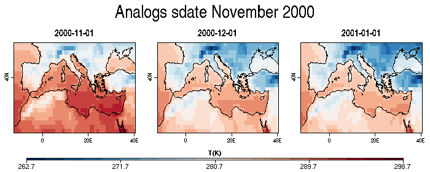
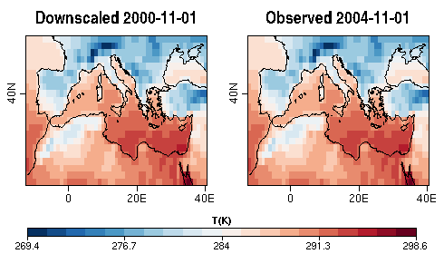
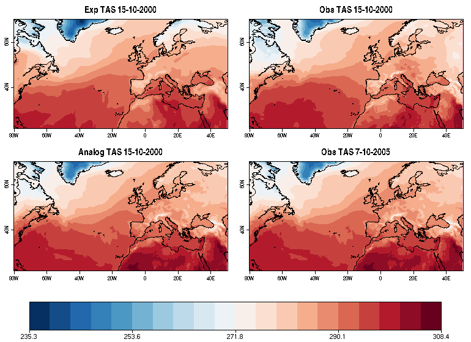
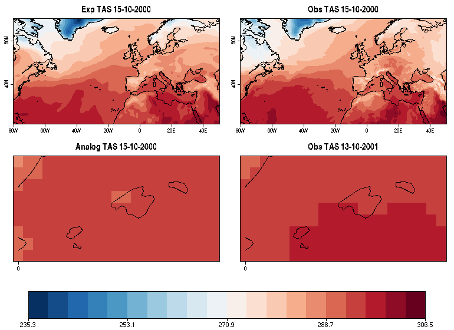
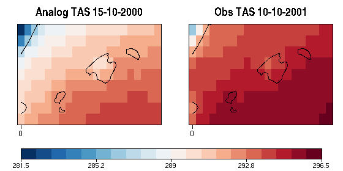

<!--
```{r, echo = FALSE}
knitr::opts_chunk$set(eval = FALSE)
```
-->
## Downscaling seasonal forecast data using Analogs

In this example, the seasonal temperature forecasts, initialized in october, 
will be used to perform a downscaling in the Balearic Islands temperature using 
the cmcc system 3 seasonal forecasting system from the Euro-Mediterranean Center
of Climate Change (CMCC), by computing Analogs in Sea level pressure data (SLP) 
in a larger region (North Atlantic). The first step will be to load the data we 
want to downscale (i.e. cmcc) in the large region (i.e North Atlantic) for 
temperature (predictand) and SLP (predictor) and same variables and region for a
higher resolution data (ERA5). In a second step we will interpolate the model to
the resolution of ERA5. In a third step we will find the analogs using one of 
the three criterias. In a four step we will get the downscaled dataset in the 
region selected (local scale, in this case Balearic Islands)

## 1. Introduction of the function

For instance if we want to perform a temperature donwscaling in Balearic Island 
for October we will get a daily series of temperature with 1 analog per day, 
the best analog. How we define the best analog for a certain day? This function
offers three options for that:

(1) The day with the minimum Euclidean distance in a large scale field: using 
i.e. pressure or geopotencial height as variables and North Atlantic region as 
large scale region. The Atmospheric circulation pattern in the North Atlantic 
(LargeScale) has an important role in the climate in Spain (LocalScale). 
The function will find the day with the most similar pattern in atmospheric 
circulation in the database (obs, slp in ERA5) to the day of interest 
(exp,slp in model). Once the date of the best analog is found, the function 
takes the associated temperature to that day (obsVar, tas in ERA5), with a 
subset of the region of interest (Balearic Island)

(2) Same that (1) but in this case we will search for analogs in the local 
scale (Balearic Island) instead of in the large scale (North Atlantic). 
Once the date of the best analog is found, the function takes the associated 
temperature to that day (obsVar, t2m in ERA5), with a subset of the region of 
interest (Balearic Island)

(3) Same that (2) but here we will search for analogs with higher correlation 
at local scale (Balearic Island) and instead of using SLP we will use t2m. 


In particular the _Analogs Method_  uses a nonlinear approach that follows 
(**Analogs**; Yiou et al. 2013) 

An efficient implementation of Analogs is provided for CSTools by the 
`CST_Analogs()` function. 

Two datasets are used to illustrate how to use the function. The first one could be enterly run by the users since it is using data samples provided along with the package. The second one uses data that needs to be downloaded or requested.

### Example 1: using data from CSTools


After loading **CSTools** package on the R session, the user will have access to the sample data `lonlat_data` and `lonlat_prec`.

*Note: If it is the first time using CSTools, install the package by running `install.packages("CSTools")`. 

```
library(CSTools)
```

After exploring the data, the user can directly run the Analogs downscaling method using the 'Large_dis' metric:

```
class(lonlat_data$exp)
names(lonlat_data$obs)
dim(lonlat_data$obs$data)
dim(lonlat_data$exp$data)
head(lonlat_data$exp$Dates$start)
```
There are 15 ensemble members available in the data set, 6 starting dates and 3
forecast times, which refer to daily values in the month of November following
starting dates on November 1st in the years 2010, 2011, 2012.

```
down <- CST_Analogs(expL = lonlat_data$exp, obsL = lonlat_data$obs)
```

The visualization of the first three time steps for the ensemble mean of the forecast initialized the 1st of Noveber 2000 can be done using the package **s2dv**:

```
library(s2dv)
PlotLayout(PlotEquiMap, c('lat', 'lon'),
    var = Reorder(MeanDims(down$data, 'member')[1,,,1,], 
                           c('time_exp', 'lat', 'lon')),  
    nrow = 1, ncol = 3,       
    lon = down$lon, lat = down$lat, filled.continents = FALSE,
    titles = c("2000-11-01", "2000-12-01", "2001-01-01"), units = 'T(K)',
    toptitle = 'Analogs sdate November 2000',
    width = 10, height = 4, fileout = './Figures/Analogs1.png') 
```

 

The user can also request extra Analogs and the information:

```
down <- CST_Analogs(expL = lonlat_data$exp, obsL = lonlat_data$obs,
                     nAnalogs = 2, AnalogsInfo = TRUE)
```

Again, the user can explore the object down1 which is class 's2dv_cube'. The element 'data' contains in this case metrics and the dates corresponding to the observed field:

```
class(down)
names(down$data)
dim(down$data$fields)
dim(down$data$metric)
dim(down$data$dates)
down$data$dates[1,15,1,1]
```

The last command run concludes that the best analog of the ensemble 15 corresponding to the 1st of November 2000 is the 1st November 2004:

```
PlotLayout(PlotEquiMap, c('lat', 'lon'), var = list(down$data$fields[1,,,15,1,1],
           lonlat_data$obs$data[1,1,5,1,,]), nrow = 1, ncol = 2,
           lon = down$lon, lat = down$lat, filled.continents = FALSE,
           titles = c("Downscaled 2000-11-01", "Observed 2004-11-01"), units = 'T(K)',
           width = 7, height = 4, fileout = './Figures/Analogs2.png') 
```



As expected, they are exatly the same.

### Exemple 2: Load data using CST_Load

In this case, the spatial field of a single forecast day will be downscale using Analogs in this example. This will allow illustrating how to use CST_Load to retrieve observations separated from simulations. To explore other options, see other CSTools vignettes as well as `CST_Load` documentation.

The simulations available for the desired model cover the period 1993-2016. Here, the 15th of October 2000 (for the simulation initialized in the 1st of October 2000), will be downscaled. 
For ERA5 from 1979 to the present days. For this example we will just use October days from 2000 to 2006, so, the starting dates can be defined by running the 
following lines:


```
start <- as.Date(paste(2000, 10, "01", sep = ""), "%Y%m%d")
end <- as.Date(paste(2006, 10, "01", sep = ""), "%Y%m%d")
dateseq <- format(seq(start, end, by = "year"), "%Y%m%d")
``` 

Using the `CST_Load` function from **CSTool package**, the data available in our
data store can be loaded. The following lines show how this function can be 
used. The experimental datasets are interpolated to the ERA5 grid by specifying the 'grid' parameter while ERA5 doesn't need to be interpolated. While parameter leadtimemax is set to 1 for the experimental dataset, it is set to 31 for the observations, returning the daily observations for October for the years requested in 'sdate' (2000-2006).
Download the data to run the recipe in the link  https://downloads.cmcc.bo.it/d_chaves/ANALOGS/data_for_Analogs.Rdat or ask carmen.alvarez-castro at cmcc.it or nuria.perez at bsc.es.

```
exp <- list(name = 'ECMWF_system4_m1',
            path = file.path("/esarchive/exp/ecmwf/system4_m1/", 
                             "$STORE_FREQ$_mean/$VAR_NAME$_*/$VAR_NAME$_$START_DATE$.nc"))
obs <- list(name = 'ERA5', 
            path = file.path("/esarchive/recon/ecmwf/era5/$STORE_FREQ$_mean/",
                            "$VAR_NAME$_f1h-r1440x721cds/$VAR_NAME$_$YEAR$$MONTH$.nc"))

expTAS <- CST_Load(var = 'tas', exp = list(exp), obs = NULL,
                   sdates = '20001001', latmin = 22, latmax = 70,
                   lonmin = -80, lonmax = 50, output ='lonlat',
                   storefreq = 'daily', nmember = 15, leadtimemin = 15,
                   leadtimemax = 15, method = "bilinear", grid = 'r1440x721',
                   nprocs = 1)
obsTAS <- CST_Load(var = 'tas', exp = NULL, obs = list(obs),
                   sdates = dateseq, leadtimemax = 31,
                   latmin = 22, latmax = 70, 
                   lonmin = -80, lonmax = 50, output = 'lonlat',
                   nprocs = 1, storefreq = "daily", nmember = 1)

expPSL <- CST_Load(var = 'psl', exp = list(exp), obs = NULL,
                   sdates = '20001001', latmin = 22, latmax = 70,
                   lonmin = -80, lonmax = 50, output ='lonlat',
                   storefreq = 'daily', nmember = 15, leadtimemin = 15,
                   leadtimemax = 15, method = "bilinear", grid = 'r1440x721',
                   nprocs = 1)
obsPSL <- CST_Load(var = 'psl', exp = NULL, obs = list(obs),
                   sdates = dateseq, leadtimemax = 31,
                   latmin = 22, latmax = 70,
                   lonmin = -80, lonmax = 50, output = 'lonlat',
                   nprocs = 1, storefreq = "daily", nmember = 1)

save(expTAS, obsTAS, expPSL, obsPSL, 
     file = "../../data_for_Analogs.Rdat",
     version = 2)
                        
#load(file = "./data_for_Analogs.Rdat")
```

*Note: `CST_Load` allows to load the data simultaneously for 'exp' and 'obs' already formatted to have the same dimensions as in this example. However, it is possible to request separated 'obs' and 'exp'. In this second case, the observations could be return in a continous time series instead of being split in start dates and forecast time.*


The s2dv_cube objects `expTAS`,`obsTAS`, `expPSL` and `obsPSL` are now loaded in the R enviroment. The first two elements correspond to the experimental and observed data for temperature and the other two are the equivalent for the SLP data.  

Loading the data using `CST_Load` allows to obtain two lists, one for the 
experimental data and another for the observe data, with the same elements and 
compatible dimensions of the data element:


```
dim(expTAS$data)
dataset  member   sdate   ftime     lat     lon 
      1      15       1       1     193     521 
dim(obsTAS$data)
dataset  member   sdate   ftime     lat     lon 
      1       1       7      31     193     521 
```


#### Two variables and criteria Large [scale] Distance:

The aim is to downscale the temperature field of the simulation for the 15th of October 2000 but looking at the pressure pattern:

```
down1 <- CST_Analogs(expL = expPSL, obsL =  obsPSL, AnalogsInfo = TRUE,
                     criteria = "Large_dist", nAnalogs = 3,
                     obsVar = obsTAS, expVar = expTAS)
```

Some warnings could appear indicating information about undefining parameters. It is possible to explore the information in object `down` by runing:

```
names(down1$data)
dim(down1$data$field)
#nAnalogs      lat      lon   member     time 
#       3      193      521       15        1 
dim(down1$data$dates)
#nAnalogs   member     time 
#       3       15        1 
down1$data$dates[1,1,1]
#"2005-10-07 UTC"
```

Now, we can visualize the output and save it using library ragg (not mandatory):

```
library(ragg)
agg_png("/esarchive/scratch/nperez/git/cstools/vignettes/Figures/Analogs3.png",
        width = 1100, height = 500, units = 'px',res = 144)
PlotLayout(PlotEquiMap, c('lat', 'lon'),
           var = list(expPSL$data[1,1,1,1,,], obsPSL$data[1,1,1,15,,],
                      obsPSL$data[1,1,6,7,,]),
           lon = obsPSL$lon, lat = obsPSL$lat, filled.continents = FALSE,
           titles = c('Exp PSL 15-10-2000','Obs PSL 15-10-2000',
                      'Obs PSL 7-10-2005'),
           toptitle = 'First member', ncol = 3, nrow = 1)
dev.off()
agg_png("/esarchive/scratch/nperez/git/cstools/vignettes/Figures/Analogs4.png",
        width = 800, height = 800, units = 'px',res = 144)
PlotLayout(PlotEquiMap, c('lat', 'lon'), var = list(
           expTAS$data[1,1,1,1,,], obsTAS$data[1,1,1,15,,],
           down1$data$field[1,,,1,1], obsTAS$data[1,1,6,7,,]),
           lon = obsTAS$lon, lat = obsTAS$lat, filled.continents = FALSE,
   titles = c('Exp TAS 15-10-2000', 'Obs TAS 15-10-2000',
              'Analog TAS 15-10-2000', 'Obs TAS 7-10-2005'),
   ncol = 2, nrow = 2)
dev.off()
```


The previous figure, shows the PSL inputs and the PSL pattern for the PSL the 7th of October, 2005, which is the best analog. *Note: Analogs automatically exclude the day is being downscaled from the observations.*

The next figure shows the input temperature fields, and the result analog which corresponds to the temperature of the 7th of October, 2005:




#### Two variables and criteria Local [scale] Distance:

The aim is to downscale the temperature simulation of the 15th of October 2000, by considering the pressure spatial pattern n the large scale and the local pressure pattern on a given region. Therefore, a region is defined providing maximum and minimum latitude and longitude coordinates, in this case, selecting the Balearic Islands: 

```
region <- c(lonmin = 0, lonmax = 5, latmin = 38.5, latmax = 40.5)
expPSL$data <- expPSL$data[1,1,1,1,,]
expTAS$data <- expTAS$data[1,1,1,1,,]
down2 <- CST_Analogs(expL = expPSL, obsL = obsPSL, AnalogsInfo = TRUE,
                     criteria = "Local_dist", nAnalogs = 50,
                     obsVar = obsTAS, expVar = expTAS,
                     region = region)
```

The parameter 'nAnalogs' doesn't correspond to the number of Analogs returned, but to the number of the best observations to use in the comparison between large and local scale.

In this case, when looking to a large scale pattern and also to local scale pattern the best analog for the first member is the 13th of October 2001:

```
down2$data$dates[1,1]
[1] "2001-10-13 UTC"
```

```
library(ClimProjDiags)
agg_png("/esarchive/scratch/nperez/git/cstools/vignettes/Figures/Analogs5.png",
        width = 800, height = 800, units = 'px',res = 144)
PlotLayout(PlotEquiMap, c('lat', 'lon'), var = list(
           expTAS$data, obsTAS$data[1,1,1,15,,],
           down2$data$field[1,,,1], SelBox(obsTAS$data[1,1,2,13,,],
           lon = as.vector(obsTAS$lon), lat = as.vector(obsTAS$lat),
           region)$data),
           special_args = list(list(lon = expTAS$lon, lat = expTAS$lat),
                              list(lon = obsTAS$lon, lat = obsTAS$lat),
                              list(lon = down2$lon, down2$lat),
                              list(lon = down2$lon, down2$lat)),
           filled.continents = FALSE,
           titles = c('Exp TAS 15-10-2000', 'Obs TAS 15-10-2000',
              'Analog TAS 15-10-2000', 'Obs TAS 13-10-2001'),
            ncol = 2, nrow = 2)
dev.off() 
```



Previous figure shows that the best Analog field corrspond to the observed field on the 13th of October 2001.


#### Two variables and criteria Local [scale] Correlation:

```
down3 <- CST_Analogs(expL = expPSL, obsL = obsPSL, AnalogsInfo = TRUE,
                     criteria = "Local_cor", nAnalogs = 50,
                     obsVar = obsTAS, expVar = expTAS,
                     region = region)
```

In this case, when looking to a large scale pattern and also to local scale pattern the best analog for the first member is the 10th of October 2001:

```
down3$data$dates[1,1]
[1] "2001-10-10 UTC"
```

```
agg_png("/esarchive/scratch/nperez/git/cstools/vignettes/Figures/Analogs6.png",
        width = 800, height = 400, units = 'px',res = 144)
PlotLayout(PlotEquiMap, c('lat', 'lon'), var = list(
           down3$data$field[1,,,1], SelBox(obsTAS$data[1,1,2,10,,],
           lon = as.vector(obsTAS$lon), lat = as.vector(obsTAS$lat),
           region)$data), lon = down3$lon, lat = down3$lat,
           filled.continents = FALSE,
           titles = c('Analog TAS 15-10-2000', 'Obs TAS 10-10-2001'),
            ncol = 2, nrow = 1)
dev.off()
```



Previous figure shows that the best Analog field corrspond to the observed field on the 10th of October 2001.

#### Downscaling using exp$data using excludeTime parameter

`ExludeTime` is set by default to Time_expL in order to find the same analog than
the day of interest. If there is some interest in excluding other dates should
be included in the argument 'excludeTime'.

```
down4 <- CST_Analogs(expL = expPSL, obsL = obsPSL, AnalogsInfo = TRUE,
                     criteria = "Large_dist", nAnalogs = 20,
                     obsVar = obsTAS, expVar = expTAS,
                     region = region, excludeTime = obsPSL$Dates$start[10:20])
```

In this case, the best analog is still being 7th of October, 2005.

 
*Note: You can compute the anomalies values before applying the criterias (as in Yiou et al, 2013) using `CST_Anomaly` of CSTools package*