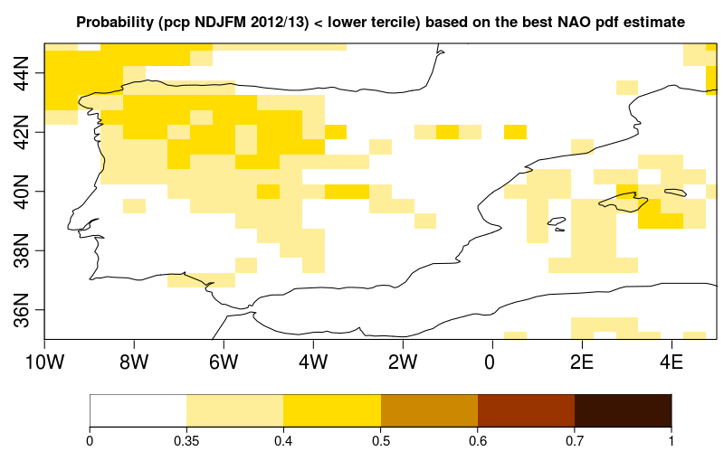
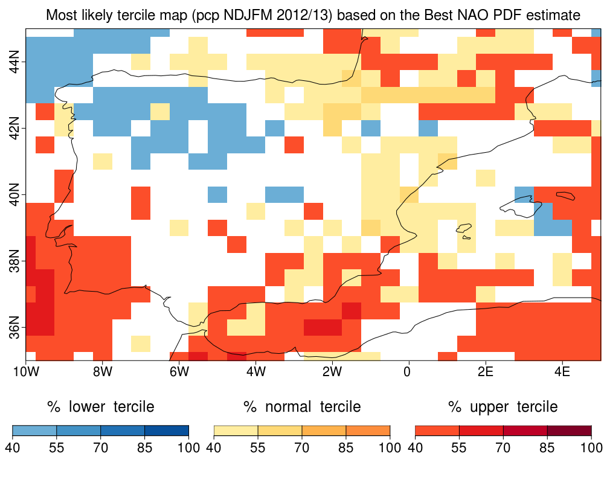
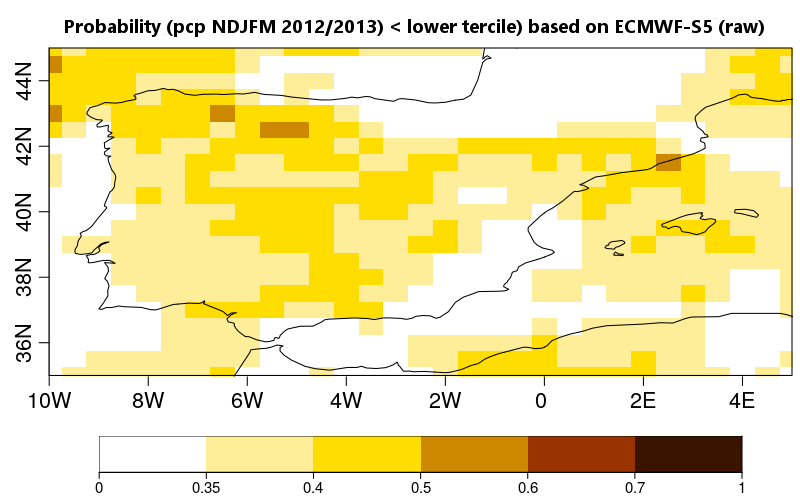
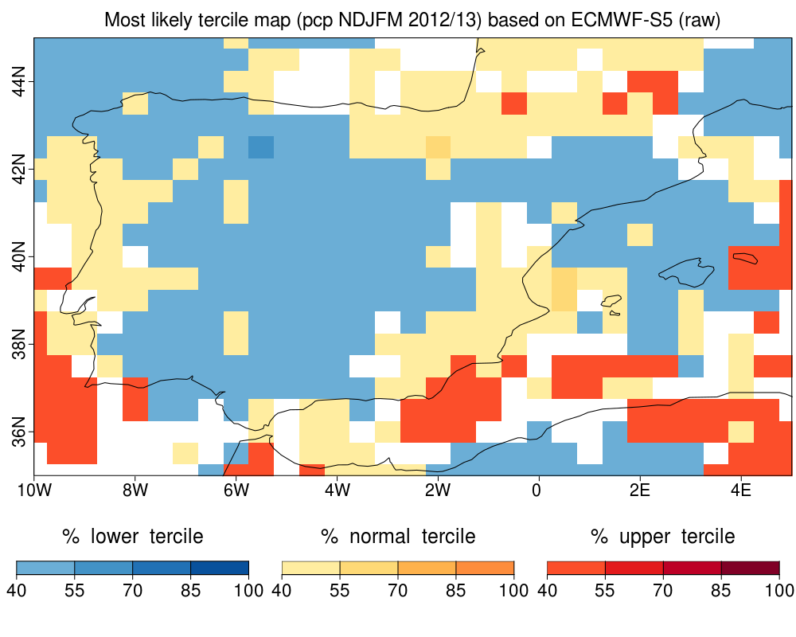

Achiving the Precipitation Best prediction giving the NAO index
-------------------------------------------------------------------

The boreal winter precipitation forecast, acumulated from November to March, can be improved by considering the NAO index. The first step is to find the best estimation of winter NAO, given by two Seasonal Forecast System (SFS). The second step is to employ the enhanced NAO index pdf to produce weights for a SFS (it could be the same or a different SFS from the previous one). The third step is to apply this weights to a precipitation field. The methodology has been proved to improve the skill on precipitation forecast in the iberian peninsula given the relation between the winter precipitation and the NAO index in seasonal time scale (Sánchez-García, E., Voces-Aboy, J., Navascués, N., & Rodríguez-Camino, E. (2019). Regionally improved seasonal forecast of precipitation through Best estimation of winter NAO, Adv. Sci. Res., 16, 165174, <https://doi.org/10.5194/asr-16-165-2019>).

This document is aim to ilustrate a practical use of the functions included in CSTools applying this methodology.


## Loading packages and data

Open an R sesion and load library CSTools:

```
library(CSTools)
```
The required data to applied this methodology are:
- the observed (reconstructed) NAO index in the reference period
- the winter index NAO for two different SFSs (SFS1 and SFS2, to combine both of them) in a reference period (hindcast) and in a future simulation (forecast)
- the winter index NAO and the acumulated precipitation field from a SFS that aims to be improved (hindcast and forecast)

Given the memory limitations, the following example uses synthetic data.

The SFS1 system is a dynamical model containing 25 ensemble members and its output will be save in the object `NAO_hind1` for the 20 years reference period and `NAO_fcst1` for a next season forecast.
The second SFS, SFS2, is a empirical model, so, the `NAO_hind2` and `NAO_fcst2` are characterized by a mean and standard deviation saved in the 'statistics' dimension.
The model for improving is a dynamical model containing 25 ensemble members.
The synthetic data is created by running the following lines:


```
# observations
NAO_obs <- rnorm(20, sd=3) 
dim(NAO_obs) <- c(time = 20)

# hindcast and forecast of a dynamical SFS 1
NAO_hind1 <- rnorm(20 * 2 * 25, sd=2.5) 
dim(NAO_hind1) <- c(time = 20, member = 50)
NAO_fcst1 <- rnorm(2*51, sd=2.5) 
dim(NAO_fcst1) <- c(time = 1, member = 102)

# hindcast and forecast of an empirical SFS 2 
NAO_hind2_mean <- rnorm(20, sd=3) 
NAO_hind2_sd <- rnorm(20, mean=5, sd=1) 
NAO_hind2 <- cbind(NAO_hind2_mean, NAO_hind2_sd) 
dim(NAO_hind2) <- c(time=20, statistic=2)
NAO_fcst2_mean <- rnorm(1, sd=3) 
NAO_fcst2_sd <- rnorm(1, mean=5, sd=1) 
NAO_fcst2 <- cbind(NAO_fcst2_mean, NAO_fcst2_sd) 
dim(NAO_fcst2) <- c(time=1, statistic=2)

```

The winter index NAO and the acumulated precipiation field from the dynamical SFS that aims to be improved could be created by running:

```
# NAO index of a SFS to compute weights for each ensemble's member 
NAO_hind <- rnorm(20 * 25, sd=2.5) 
dim(NAO_hind) <- c(time = 20, member = 25)
NAO_fcst <- rnorm(51, sd=2.5) 
dim(NAO_fcst) <- c(time = 1, member = 51)

# The acumulated precipiation field
prec_hind <- rnorm(20 * 25 * 21 * 31, mean=30, sd=10) 
dim(prec_hind) <- c(time = 20, member = 25, lat = 21, lon = 31)
prec_hind <- list(data = prec_hind)
class(prec_hind) <- 's2dv_cube'
prec_fcst <- rnorm(51 * 21 * 31, mean=25,sd=8) 
dim(prec_fcst) <- c(time = 1, member = 51, lat = 21, lon = 31)
prec_fcst <- list(data = prec_fcst)
class(prec_fcst) <- 's2dv_cube'

```


## 1- Best Estimate Index NAO

The function `PDFBest` performes the next steps:
 - improves the PDF NAO index for each SFS (it could use bias correction method) and 
 - does a statistical combination of these improved NAO indexes.
Its output is an array containing the parameters (mean and starndar deviation) of the PDF for the reference period (hindcast) or forecast period. 


```
# for hindcast 
pdf_hind_best <- BEI_PDFBest(NAO_obs, NAO_hind1, NAO_hind2, index_fcst1 = NULL,
                             index_fcst2 = NULL, method_BC = 'none',
                             time_dim_name = 'time', na.rm = FALSE)
# for forecast                             
pdf_fcst_best <- BEI_PDFBest (NAO_obs, NAO_hind1, NAO_hind2, index_fcst1 = NAO_fcst1,
                             index_fcst2 = NAO_fcst2, method_BC = 'none',
                             time_dim_name = 'time', na.rm = FALSE)
```


## 2- Compute weights using the Best Estimation of Index NAO


An array of weights is calculated for the SFS. This SFS could be the same or different SFS than the ones in section 1. 
The function WeightIndex computes these weights for each ensemble's member based on the best NAO PDF estimate.


```
# for hindcast 
weights_hind <- BEI_Weights(NAO_hind, pdf_hind_best)
# for forecast
weights_fcst <- BEI_Weights(NAO_fcst, pdf_fcst_best)

```

The expected dimensions of these weights are 'member' and temporal dimension.


## 3- Apply weights to a precipitation field


The function `CST_BEI_Weighting` computes the ensemble mean or the terciles probabilities for a climate variable. 
The ensemble mean and the probabilities of terciles from the weighted precipitation field is obtained by running:

```
# for hindcast
em_prec_hind <- CST_BEI_Weighting(prec_hind, weights_hind, type = 'ensembleMean')
prob_prec_hind <- CST_BEI_Weighting(prec_hind, weights_hind, type = 'probs')

# for forecast
em_prec_fcst <- CST_BEI_Weighting(prec_fcst, weights_fcst, type = 'ensembleMean')
prob_prec_fcst <- CST_BEI_Weighting(prec_fcst, weights_fcst, type = 'probs')

```

## Comparison and visualization

The original model output can be compared against the BEI corrected field.
To do this a equiprobability weights are created for hindcast period and they are applied to the original precipitation field:


```
aweights_raw <- rep(1/25, 20 * 25)
dim(aweights_raw) <- dim(weights_hind)

em_prec_raw <- CST_BEI_Weighting(prec_hind, aweights_raw, type = 'ensembleMean')
prob_prec_raw <- CST_BEI_Weighting(prec_hind, aweights_raw, type = 'probs')

```

A map with the probability that the total precipitation will be in the lower/normal/upper tercile based on the Best Estimate Index NAO could be obtained using the 'PlotEquiMap' function or 'PlotMostLikelyQuantileMap' function from 'CSToools' package.

The following figures show the probabilities for lower tercile for precipitation from November to March 2012/13 for ECMWF S5 system applying the methodology exposed or not, obtained using real data: 
- NAO indices from the ECMWF-S5 dynamical model and the S-ClimWaRe empirical model from AEMET from 1997 to 2016 for computing the Best Estimation of Index NAO fro this hindcast period.
- The winter precipitation (from November to March) from 1997 to 2016 over Iberia Peninsula from he ECMWF-S5 dynamical model with resolution 0.5º x 0.5º, to weighting with the previous Best Estimation of Index NAO.   







In a similar way we can plot the map with the probability that the total precipitation from November 2012 to
March 2013, for example, will be in the lower tercile from ECMWF Seasonal Forecast System 5 (raw) to compare results running the code:





