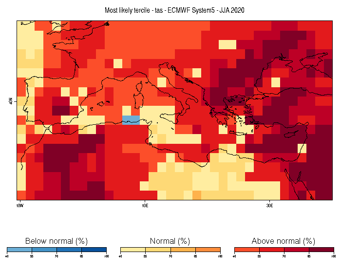
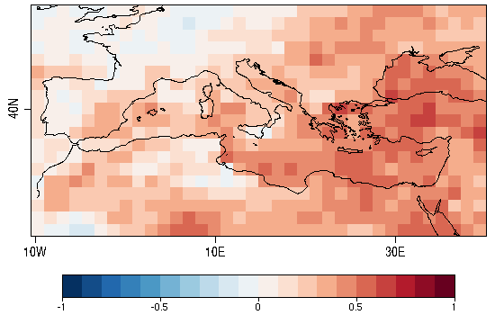
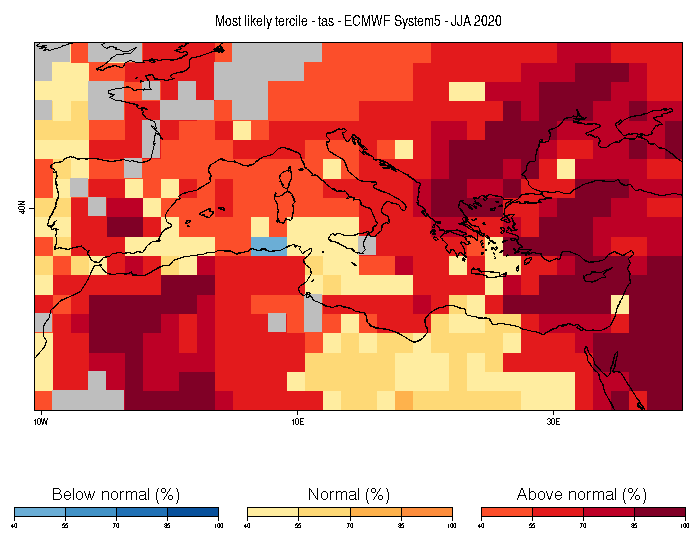

Computing and displaying the most likely tercile of a seasonal forecast
========================

In this example, we will use CSTools to visualize a probabilistic forecast (most likely tercile) of summer near-surface temperature produced by ECMWF System5. The (re-)forecasts used are initilized on May 1st for the period 1981-2020. The target for the forecast is June-August (JJA) 2020. The forecast data are taken from the Copernicus Climate Data Store.


### 1. Preliminary setup 


To run this vignette, the following R packages should be installed and loaded:


```r
library(CSTools)
library(s2dv)
library(zeallot)
library(easyVerification)
library(ClimProjDiags)
```


### 2. Loading the data


We first define a few parameters. We start by defining the region we are interested in. In this example, we focus on the Mediterranean region.


```r
lat_min = 25
lat_max = 52
lon_min = -10  
lon_max = 40
```

If the boundaries are not specified, the domain will be the entire globe.

We also define the start dates for the hindcasts/forecast (in this case, May 1st 1981-2020) and create a sequence of dates that will be required by the load function.


```r
ini <- 1981
fin <- 2020
numyears <- fin - ini +1
mth = '05'
start <- as.Date(paste(ini, mth, "01", sep = ""), "%Y%m%d")
end <- as.Date(paste(fin, mth, "01", sep = ""), "%Y%m%d")
dateseq <- format(seq(start, end, by = "year"), "%Y%m%d")
```

We then define the target months for the forecast (i.e. JJA). The months are given relative to the start date (May in this case) considering that monthly simulations are being analyzed.


```r
mon1 <- 2
monf <- 4
```


Finally, we define the forecast system, an observational reference, the variable of interest and the common grid onto which to interpolate. 


```r
forecastsys <- 'system5c3s'
obs <- 'erainterim'
grid <- "256x128"
clim_var = 'tas'
```

Finally, the data are loaded using `CST_Load`: 


```r
c(exp,obs) %<-% CST_Load(var = clim_var, exp = forecastsys, obs = obs,
                         sdates = dateseq, leadtimemin = mon1, leadtimemax = monf,
                         lonmin = lon_min, lonmax = lon_max,
                         latmin = lat_min, latmax = lat_max, 
                         storefreq = "monthly", sampleperiod = 1,  nmember = 10, 
                         output = "lonlat", method = "bilinear", 
                         grid = paste("r", grid, sep = ""))
```

Loading the data using CST_Load returns two objects, one for the experimental data and another one for the observe data, with the same elements and compatible dimensions of the data element:


```r
> dim(exp$data)
dataset  member   sdate   ftime     lat     lon 
      1      10      40       3      19      36 
> dim(obs$data)
dataset  member   sdate   ftime     lat     lon 
      1       1      40       3      19      36 
```


The latitude and longitude are saved for later use:


```r
Lat <- exp$lat
Lon <- exp$lon
```

### 3. Computing probabilities

First, anomalies of forecast and observations are computed using cross-validation on individual members:


```
c(Ano_Exp, Ano_Obs) %<-% CST_Anomaly(exp = exp, obs = obs, cross = TRUE, memb = TRUE)
```


The seasonal mean of both forecasts and observations are computed by averaging over the ftime dimension.


```r
Ano_Exp$data <- MeanDims(Ano_Exp$data, 'ftime')
Ano_Obs$data <- MeanDims(Ano_Obs$data, 'ftime')
```


Finally, the probabilities of each tercile are computed by evaluating which tercile is forecasted by each ensemble member for the latest forecast (2020) using the function `ProbBins` in **s2dv** and then averaging the results along the member dimension to obtain the probability of each tercile.


```r
PB <- ProbBins(Ano_Exp$data, fcyr = numyears, thr = c(1/3, 2/3), compPeriod = "Without fcyr")
prob_map <- MeanDims(PB, c('sdate', 'member', 'dataset'))
```


### 4. Visualization with PlotMostLikelyQuantileMap


We then plot the most likely quantile using the **CSTools** function `PlotMostLikelyQuantileMap`. 


```
PlotMostLikelyQuantileMap(probs = prob_map, lon = Lon, lat = Lat,
                          coast_width = 1.5, legend_scale = 0.5, 
                          toptitle = paste0('Most likely tercile - ', clim_var,
                                            ' - ECMWF System5 - JJA 2020'), 
                          width = 10, height = 8)
```



The forecast calls for above average temperature over most of the Mediterranean basin and near average temperature for some smaller regions as well. But can this forecast be trusted? 

For this, it is useful evaluate the skill of the system at forecasting near surface temperature over the period for which hindcasts are available. We can then use this information to mask the regions for which the system doesn't have skill. 

In order to do this, we will first calculate the ranked probability skill score (RPSS) and then exclude/mask from the forecasts the regions for which the RPSS is smaller or equal to 0 (no improvement with respect to climatology).


### 5. Computing Skill Score


First, we evaluate and plot the RPSS. Therefore, we use `RPSS` metric included in CST_MultiMetric from function from **easyVerification** package which requires to remove missing values from latest start dates:


```r
Ano_Exp$data <- Subset(Ano_Exp$data, along = 'sdate', indices = 1:38)
Ano_Obs$data <- Subset(Ano_Obs$data, along = 'sdate', indices = 1:38) 
RPSS <- CST_MultiMetric(Ano_Exp, Ano_Obs, metric = 'rpss', multimodel = FALSE)

PlotEquiMap(RPSS$data[[1]], lat = Lat, lon = Lon, brks = seq(-1, 1, by = 0.1),
            filled.continents = FALSE)
```





Areas displayed in red (RPSS > 0) are areas for which the forecast system shows skill above climatology whereas areas in blue (such as a large part of the Iberian Peninsula) are areas for which the model does not. We thus want to mask the areas currently displayed in blue.

### 6. Simultaneous visualization of probabilities and skill scores

From the RPSS, we create a mask: regions with RPSS <= 0 will be masked. 


```r
mask_rpss <- ifelse((RPSS$data$skillscore <= 0) | is.na(RPSS$data$skillscore), 1, 0)
```

Finally, we plot the latest forecast, as in the previous step, but add the mask we just created.


```r
PlotMostLikelyQuantileMap(probs = prob_map, lon = Lon, lat = Lat, coast_width = 1.5,
                          legend_scale = 0.5, mask = mask_rpss[ , , 1],
                          toptitle = paste('Most likely tercile -', clim_var,
                                           '- ECMWF System5 - JJA 2020'),
                          width = 10, height = 8)
```

 

We obtain the same figure as before, but this time, we only display the areas for which the model has skill at forecasting the right tercile. The gray regions represents areas where the system doesn't have sufficient skill over the verification period.


