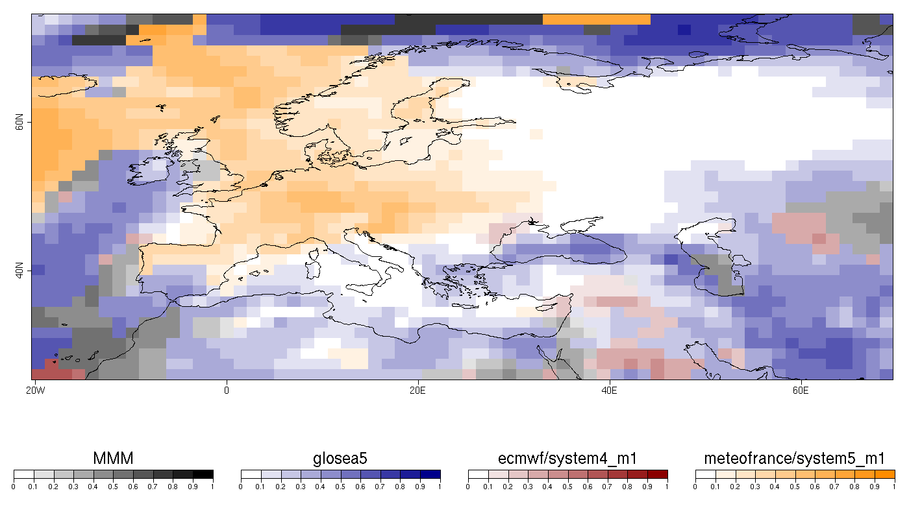
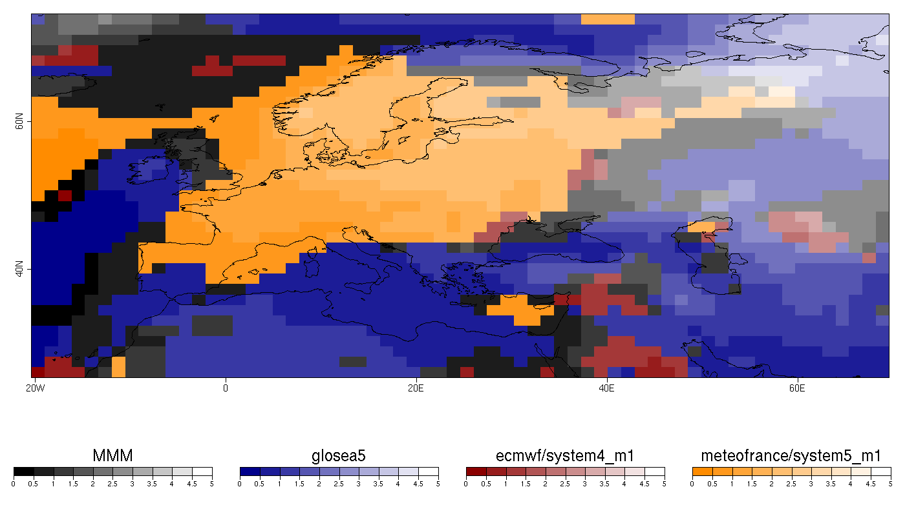

Multi-model Skill Assessment
-----------------------------------------

**reference**: Mishra, N., Prodhomme, C., & Guemas, V. (2018). Multi-Model Skill Assessment of Seasonal Temperature and Precipitation Forecasts over Europe, 29-31. <https://doi.org/10.1007/s00382-018-4404-z>


The R package s2dv should be loaded by running:

```r
library(s2dv)
library(zeallot)
```

Library *CSTools*, should be installed from CRAN and loaded:


```r
install.packages("CSTools")
library(CSTools)
```

### 1.- Load data

In this case, the seasonal temperature forecasted, initialized in November, will be used to assess the EUROSIP multi-model seasonal forecasting system consists of a number of independent coupled seasonal forecasting systems integrated into a common framework. From September 2012, the systems include those from ECMWF, the Met Office, Meteo-France and NCEP.

The parameters defined are the initializating month and the variable:


```{r cars}
mth = '11'
clim_var = 'tas'
```


The simulations available for these models are covering the period 1993-2012. So, the starting and ending dates can be defined by running the following lines:


```r
ini <- 1993
fin <- 2012
start <- as.Date(paste(ini, mth, "01", sep = ""), "%Y%m%d")
end <- as.Date(paste(fin, mth, "01", sep = ""), "%Y%m%d")
dateseq <- format(seq(start, end, by = "year"), "%Y%m")
``` 

The grid in which all data will be interpolated needs to be specified within the `CST_Start` call (256x128 grid). The observational dataset used in this example is the EraInterim. 

Using the `CST_Start` function, the data available in our data store can be loaded. The following lines, shows how this function can be used. However, the data is loaded from a previous saved `.RData` file:
Ask nuria.perez at bsc.es to achieve the data to run the recipe.

```r
lonmin = -20
lonmax = 70
latmin = 25
latmax = 75
repos1 <- "/esarchive/exp/glosea5/glosea5c3s/monthly_mean/$var$_f6h/$var$_$sdate$.nc"
repos2 <- "/esarchive/exp/ecmwf/system4_m1/monthly_mean/$var$_f6h/$var$_$sdate$01.nc"
repos3 <- "/esarchive/exp/meteofrance/system5_m1/monthly_mean/$var$_f6h/$var$_$sdate$01.nc"

exp <- CST_Start(dataset = list(list(name = 'glosea5c3s', path = repos1),
                                list(name = 'ecmwf/system4_m1', path = repos2),
                                list(name = 'meteofrance/system5_m1', path = repos3)),
                 var = clim_var,
                 member = indices(1:4), sdate = dateseq, ftime = indices(2:4),
                 lat = values(list(latmin, latmax)),
                 lat_reorder = Sort(decreasing = TRUE),
                 lon = values(list(lonmin, lonmax)),
                 lon_reorder = CircularSort(0, 360),
                 synonims = list(lon = c('lon', 'longitude'), lat = c('lat', 'latitude'),
                                 member = c('member', 'ensemble'), ftime = c('ftime', 'time')),
                 transform = CDORemapper,
                 transform_extra_cells = 2,
                 transform_params = list(grid = 'r256x128', method = 'bilinear'),
                 transform_vars = c('lat', 'lon'),
                 return_vars = list(lat = 'dataset', lon = 'dataset', ftime = 'sdate'),
                                    retrieve = TRUE)

dates_exp <- exp$attrs$Dates
repos_obs <- "/esarchive/recon/ecmwf/erainterim/monthly_mean/$var$/$var$_$date$.nc"
obs <- CST_Start(dataset = list(list(name = 'erainterim', path = repos_obs)),
                 var = clim_var,
                 date =  unique(format(dates_exp, '%Y%m')),
                 ftime = values(dates_exp), 
                 ftime_across = 'date',
                 ftime_var = 'ftime',
                 merge_across_dims = TRUE,
                 split_multiselected_dims = TRUE,
                 lat = values(list(latmin, latmax)),
                 lat_reorder = Sort(decreasing = TRUE),
                 lon = values(list(lonmin, lonmax)),
                 lon_reorder = CircularSort(0, 360),
                 synonims = list(lon = c('lon', 'longitude'),
                                 lat = c('lat', 'latitude'),
                                 ftime = c('ftime', 'time')),
                 transform = CDORemapper,
                 transform_extra_cells = 2,
                 transform_params = list(grid = 'r256x128',
                                         method = 'bilinear'),
                 transform_vars = c('lat', 'lon'),
                 return_vars = list(lon = NULL,
                                    lat = NULL,
                                    ftime = 'date'),
                 retrieve = TRUE)

# save(exp, obs, file = "../tas_toydata.RData")   

# Or use the following line to load the file provided in .RData format:
# load(file = "./tas_toydata.RData")
```

There should be two new elements loaded in the R working environment: `exp` and `obs`, containing the experimental and the observed data for temperature. It is possible to check that they are of class `sd2v_cube` by running:

```
class(exp)
class(obs)
```

The corresponding data is saved in the element `data` of each object, while other relevant information is saved in different elements, such as `lat` and `lon`:

```r
> dim(exp$data)
dataset   var   member   sdate   ftime     lat     lon 
      3    1       9       20       3       35      64 
> dim(obs$data)
dataset     var   sdate   ftime     lat     lon 
      1       1      20       3      35      64 
Lat <- exp$coords$lat
Lon <- exp$coords$lon
```

### 2.- Computing and plotting Anomaly Correlation Coefficient

The Anomaly Correlation Coefficient (ACC) is the most widely used skill metric for Seasonal Climate Forecast quality (Mishra et al., 2018). 

First step is to compute the anomalies over the loaded data applying cross validation technique on individual members by running:

```
c(ano_exp, ano_obs) %<-% CST_Anomaly(exp = exp, obs = obs, cross = TRUE, memb = TRUE)
```

The dimensions are preserved:

```
> str(ano_exp$data)
 num [1:20, 1:3, 1:9, 1, 1:3, 1:35, 1:64] -1.399 -0.046 -0.133 0.361 -5.696 ...
> str(ano_obs$data)
 num [1:20, 1, 1, 1, 1:3, 1:35, 1:64] 1.556 1.397 -0.346 -5.99 -0.273 ...
```

The ACC is obtained by running the `CST_MultiMetric` function defining the parameter 'metric' as correlation. The function also includes the option of computing the Multi-Model Mean ensemble (MMM).


```r
ano_obs <- CST_InsertDim(ano_obs, posdim = 3, lendim = 1, name = "member")
AnomDJF <- CST_MultiMetric(exp = ano_exp, obs = ano_obs, metric = 'correlation', 
                           multimodel = TRUE)
```

The output of the function `CST_MultiMetric` is a object of class `s2dv_cube`, it contains the result of the metric, in this case correlation, in the `data` element (including the correlation for the MMM in the latest position).
While other relevant data is being stored in the corresponding element of the object:


```r
> str(AnomDJF$data)
List of 4
 $ corr      : num [1:4, 1, 1, 1:35, 1:64] 0.3061 0.4401 0.0821 0.2086 0.1948 ...
 $ p.val     : num [1:4, 1, 1, 1:35, 1:64] 0.0947 0.0261 0.3653 0.1887 0.2052 ...
 $ conf.lower: num [1:4, 1, 1, 1:35, 1:64] -0.15782 -0.00297 -0.37399 -0.25768 -0.27106 ...
 $ conf.upper: num [1:4, 1, 1, 1:35, 1:64] 0.659 0.739 0.506 0.596 0.587 ...
> names(AnomDJF)
[1] "data"   "dims"   "coords" "attrs" 
> AnomDJF$attrs$Datasets
[1] "glosea5"                "ecmwf/system4_m1"       "meteofrance/system5_m1" "erainterim"    
```
 
In the element $data of the `AnomDJF` object is a list of object for the metric and its statistics: correlation, p-value, the lower limit of the 95% confidence interval and the upper limit of the 95% confidence interval and the 95% significance level given by a one-sided T-test. 

To obtain a spatial plot with a scale from -1 to 1 value of correlation for the model with the highest correlation for each grid point, the following lines should be run:

```r
PlotCombinedMap(AnomDJF$data$corr[,1,1,,], lon = Lon, lat = Lat, map_select_fun = max,
                display_range = c(0, 1), map_dim = 'nexp',
                legend_scale = 0.5, brks = 11,
                cols = list(c('white', 'black'),
                            c('white', 'darkblue'),
                            c('white', 'darkred'),
                            c('white', 'darkorange')),
                bar_titles = c("MMM", AnomDJF$attrs$Datasets),
                width = 14, height = 8)                
```

The next figure is the map of the maximum positive Anomaly Correlation Coefficient (ACC) among the three individual models from EUROSIP and the multimodel ensemble. ACC for each model is calculated between their respective predicted ensemble mean anomalies and the anomalies of the observed temperature obtained from ERAINT for winter (DJF) seasons over the period 1993-2012. Blue, red, yellow and black colors indicate that the maximum correlation is obtained for GloSea5, ECMWF, MF and the Multi-Model Mean respectively (similar to figure 3 in Mishra et al., 2018).





### 3.- Computing and plotting Root Mean Square error (RMS)

The same function can be used to compute the RMS error by defining the parameter `metric` as 'rms'.

```r
AnomDJF <- CST_MultiMetric(exp = ano_exp, obs = ano_obs, metric = 'rms', 
                           multimodel = TRUE)
```

The following lines are necessary to obtain the plot which visualizes the best model given this metric for each grid point. 

```r
PlotCombinedMap(AnomDJF$data$rms[,1,1,,], lon = Lon, lat = Lat, map_select_fun = min,
                display_range = c(0, ceiling(max(abs(AnomDJF$data$rms)))), map_dim = 'nexp',
                legend_scale = 0.5, brks = 11,
                cols = list(c('black', 'white'),
                            c('darkblue', 'white'),
                            c('darkred', 'white'),
                            c('darkorange', 'white')),
                bar_titles = c("MMM", AnomDJF$attrs$Datasets), 
                width = 14, height = 8)              
```




### 4.- Computing and plotting Root Mean Square error Skill Scores (RMSSS)


By running the following lines a plot for the best model given the RMSSS is obtained. 
When parameter `metric` is defined as `rmsss`, the RMSSS are stored in the first position on the third dimension of the `metric` component in the AnoMultiMetric output. 
Notice that the perfect RMSSS is 1 and the parameter  `map_select_fun` from `PlotCombinedMap` function (see *s2dv R package*) has been defined in order to select the best model.


```r
AnomDJF <- CST_MultiMetric(exp = ano_exp, obs = ano_obs, metric = 'rmsss', 
                           multimodel = TRUE)

PlotCombinedMap(AnomDJF$data$rmsss[,1,1,,], lon = Lon, lat = Lat, 
                map_select_fun = function(x) {x[which.min(abs(x - 1))]},
                display_range = c(0, 
                                  ceiling(max(abs(AnomDJF$data$rmsss)))), map_dim = 'nexp',
                legend_scale = 0.5, brks = 11,
                cols = list(c('white', 'black'),
                            c('white', 'darkblue'),
                            c('white', 'darkred'),
                            c('white', 'darkorange')),
                bar_titles = c("MMM", AnomDJF$attrs$Datasets), 
                width = 14, height = 8)                
```


