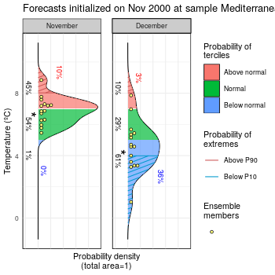

Plot Forecast PDFs (Probability Distibution Functions)
------------------------------------------

Library *CSTools*, should be installed from CRAN and loaded:


```{r,warning=FALSE,message=FALSE,error=FALSE}
library(CSTools)
```

### 1. A simple example

The first step is to put your forecasts in an appropriate format. For this vignette we generate some random values from two normal distributions. The PlotForecastPDF by default will plot the ensemble members, the estimated density distributions and the tercile probabilities.

```{r,fig.show = 'hide',warning=F}
fcst <- data.frame(fcst1 = rnorm(mean = 25, sd = 3, n = 30), 
									 fcst2 = rnorm(mean = 23, sd = 4.5, n = 30))
PlotForecastPDF(fcst, tercile.limits = c(20, 26))
```


Input data can also be provided as an two-dimensional array, as far as one of the dimensions is named 'member' or adjusted in 'memb_dim' parameter:

```{r,fig.show = 'hide',warning=F}
fcst <- array(rnorm(mean = 25, sd = 2, n = 90), dim = c(member = 30, 3))
PlotForecastPDF(fcst, tercile.limits = c(23, 27))
```

### 2. Customizing the appearance of your plots 
Some parameters allow to customize your plot by changing the title, the forecast labels, the variable name and units, or the colors. 

```{r,fig.show = 'hide',warning=F}
fcst <- data.frame(fcst1 = rnorm(mean = 25, sd = 3, n = 30),
									 fcst2 = rnorm(mean = 23, sd = 4.5, n = 30))
PlotForecastPDF(fcst, tercile.limits = c(20, 26), var.name = "Temperature (ºC)",
								title = "Forecasts valid for 2019-01-01 at Sunny Hills", 
								fcst.names = c("model a", "model b"),
								color.set = "s2s4e")
```


### 3. Adding extremes and observed values
Optionally, we can include the probability of extreme values or the actually observed values. The tercile limits, extreme limits and observation values can be specified for each panel separately.

```{r,fig.show = 'hide',warning=F}
fcst <- data.frame(fcst1 = rnorm(mean = 25, sd = 3, n = 30), 
									 fcst2 = rnorm(mean = 28, sd = 4.5, n = 30), fcst3 = rnorm(mean = 17, sd = 3, n = 30))
PlotForecastPDF(fcst, tercile.limits = rbind(c(20, 26), c(22, 28), c(15, 22)), 
								var.name = "Temperature (ºC)", title = "Forecasts at Sunny Hills", 
								fcst.names = c("January", "February", "March"), obs = c(21, 24, 17), 
								extreme.limits = rbind(c(18, 28), c(20, 30), c(12, 24)),
								color.set = "s2s4e")
```


### 4. Saving your plot to a file
PlotForecastPDF uses ggplot2, so you can save the output of the function to a variable and operate with it as a ggplot2 object. For instance, you can save it to a file:

```
library(ggplot2)
fcst <- array(rnorm(mean = 25, sd = 2, n = 90), dim = c(member = 30, 3))
plot <- PlotForecastPDF(fcst, tercile.limits = c(23, 27))
ggsave("outfile.pdf", plot, width = 7, height = 5)
```

### 5. A reproducible example using lonlat_temp_st
This final example uses the sample lonlat data from CSTools. It is suitable for checking reproducibility of results.

```{r,fig.show = 'hide',warning=F}
fcst <- data.frame(fcst1 = lonlat_temp_st$exp$data[1,1,,1,1,1,1] - 273.15,
                   fcst2 = lonlat_temp_st$exp$data[1,1,,1,2,1,1] - 273.15)
PlotForecastPDF(fcst, tercile.limits = c(5, 7), extreme.limits = c(4, 8), 
								var.name = "Temperature (ºC)",
								title = "Forecasts initialized on Nov 2000 at sample Mediterranean region", 
								fcst.names = c("November", "December"))
```


