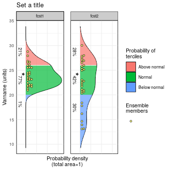
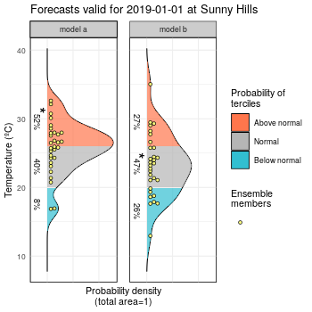
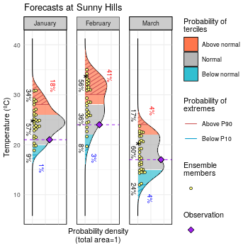

Plot Forecast PDFs (Probability Distibution Functions)
------------------------------------------

Library *CSTools*, should be installed from CRAN and loaded:


```{r,warning=FALSE,message=FALSE,error=FALSE}
library(CSTools)
```

### 1.- A simple example

The first step is to put your forecasts in an appropriate format. For this vignette we generate some random values from two normal distributions. The PlotForecastPDF by default will plot the ensemble members, the estimated density distributions and the tercile probabilities.

```{r,fig.show = 'hide',warning=F}
fcst <- data.frame(fcst1=rnorm(mean=25,sd=3,n=30),fcst2=rnorm(mean=23,sd=4.5,n=30))
PlotForecastPDF(fcst,tercile.limits=c(20,26))
```



### 2.- Some useful parameters
Changing the title, the forecast labels or the units will be needed in most cases.

```{r,fig.show = 'hide',warning=F}
fcst <- data.frame(fcst1=rnorm(mean=25,sd=3,n=30),fcst2=rnorm(mean=23,sd=4.5,n=30))
PlotForecastPDF(fcst,tercile.limits=c(20,26),var.name="Temperature (ºC)",title="Forecasts valid on 2019-01-01 at Sunny Hills",fcst.names = c("model a","model b"))
```


### 3.- Adding extremes and observed values
We can add the probability of extreme values and the observed values. The tercile and extreme limits can be specified for each panel separately, as well as the observed values.
```{r,fig.show = 'hide',warning=F}
fcst <- data.frame(fcst1=rnorm(mean=25,sd=3,n=30),fcst2=rnorm(mean=28,sd=4.5,n=30),fcst3=rnorm(mean=17,sd=3,n=30))
PlotForecastPDF(fcst,tercile.limits=rbind(c(20,26),c(22,28),c(15,22)),var.name="Temperature (ºC)",title="Forecasts at Sunny Hills",fcst.names = c("January","February","March"),obs=c(21,24,17),extreme.limits = rbind(c(18,28),c(20,30),c(12,24)))
```

