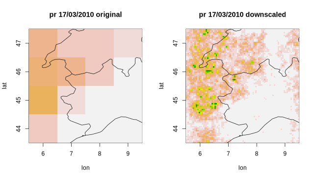

<!--
```{r, echo = FALSE}
knitr::opts_chunk$set(eval = FALSE)
```
-->

## Introduction

It becomes often necessary to bridge the scale gap between climate scenarios of precipitation obtained from global and regional climate models and the small scales needed for impact studies, in order to measure uncertainty and reproduce extremes at these scales. An effective approach is provided by stochastic downscaling techniques (Ferraris et al. 2003a,b), in particular so-called full-field weather generators, which aim at generating synthetic spatiotemporal precipitation fields whose statistical properties are consistent with the small-scale statistics of observed precipitation, based only on knowledge of the large-scale precipitation field. These methods allow for example to estimate uncertainties at small scales in rainfall scenarios, by generating large ensembles of synthetic small-scale precipitation fields. 

In particular the _Rainfall Filtered Autoregressive Model_ (**RainFARM**; Rebora et al. 2006a,b) 
is a stochastic downscaling procedure based on the nonlinear transformation of a linearly correlated stochastic field, generated by small-scale extrapolation of the Fourier spectrum of a large-scale precipitation field. Developed originally for downscaling at weather timescales, the method has been adapted for downscaling at climate timescales by D'Onofrio et al. 2014 and recently improved for regions with complex orography in Terzago et al. 2018. 

An efficient implementation of RainFARM is provided for CSTools by the `CST_RainFARM()` and `RainFARM()` functions. 

## Downscaling seasonal precipitation forecasts with RainFARM

### Preliminary setup

In order to run the examples in this vignette, the *CSTools* package and some other support R packages need to be loaded by running:

```{r}
install.packages('CSTools')
library(CSTools)
```

We use test data provided by CSTools to load a seasonal precipitation forecast: 

```{r}
exp <- lonlat_prec_st
```

This gives us a CSTools object `exp`, containing an element `exp$data` with dimensions:
```{r}  
dim(exp$data)
#   dataset   var   member   sdate   ftime     lat    lon 
#      1       1       6       3       31       4      4 
```
There are 6 ensemble members available in the data set, 3 starting dates and 31 forecast times, which refer to daily values in the month of March following starting dates on November 1st in the years 2010, 2011, 2012. Please notice that RainFARM (in this version) only accepts square domains, possibly with an even number of pixels on each side, so we always need to select an appropriate cutout. Also, there are time and memory limitations when a large ensemble of downscaled realizations is generated with RainFARM, so that selecting a smaller target area is advised. On the other hand, if spectral slopes are to be determined from the large scales we will still need enough resolution to allow this estimation. In this example we have preselected a 4x4 pixel cutout at resolution 1 degree in a smaller area lon=[6,9], lat=[44,47] covering Northern Italy.

```{r}  
ilon <- which(exp$coords$lon %in% 5:12)
ilat <- which(exp$coords$lat %in% 40:47)
exp$data <- exp$data[, , , , , ilat, ilon, drop = FALSE]
names(dim(exp$data)) <- names(dim(lonlat_prec_st$data))
exp$coords$lon <- exp$coords$lon[ilon]
exp$coords$lat <- exp$coords$lat[ilat]
```

### Standard downscaling without climatological weights

Our goal is to downscale with RainFARM these data from the resolution of 1 degree (about 100 km at these latitudes) to 0.05 degrees (about 5 km) using the `CST_RainFARM()` function. This means that we need to increase resolution by a factor `nf = 20`. 
RainFARM can compute automatically its only free parameter, i.e. the spatial spectral slope, from the large-scale field (here only with size 4x4 pixel, but in general we reccomend selecting at least 8x8 pixels). 
In this example we would like to compute this slope as an average over the _member_ and _ftime_ dimensions, while we will use different slopes for the remaining _dataset_ and _sdate_ dimensions (a different choice may be more appropriate in a real application). To obtain this we specify the parameter `time_dim = c("member", "ftime")`. The slope is computed starting from the wavenumber corresponding to the box, `kmin = 1`. We create 3 stochastic realizations for each dataset, member, starting date and forecast time with `nens = 5`. The command to donwscale and the resulting fields are:

```
exp_down <- CST_RainFARM(exp, nf = 20, kmin = 1, nens = 3,
                         time_dim = c("member", "ftime"))

dim(exp_down$data)
#   dataset    var    member   realization   sdate    ftime    lat    lon 
#      1        1         6          3         3        31      80     80 

str(exp_down$coords$lon)
# num [1:80] 5.53 5.58 5.62 5.67 5.72 ...
str(exp_down$coords$lat)
# num [1:80] 47.5 47.4 47.4 47.3 47.3 ...
```
The function returns an array `exp_down$data` with the additional "realization" dimension for the stochastic ensemble with 3 members. The longitudes and latitudes have been correspondingly interpolated to the finer resolution. 

Alternatively we could have used the "reduced" function `RainFARM` which accepts directly a data array (with arbitrary dimensions, provided a longitude, a latitude and a "time" dimension exist) and two arrays to describe longitudes and latitudes:

```{r}  
downscaled <- RainFARM(exp$data, exp$coords$lon, exp$coords$lat, 
                       nf = 20, kmin = 1, nens = 3,
                       time_dim = c("member", "ftime"))
```
The resulting array has the same dimensions as the `$data` element in the result of `CST_RainFARM`.

Each instant and each realization will of course be different, but let's plot and compare the original and the downscaled data of the first ensemble member and for the first realization for a specific forecast date (Fig. 1):

<!--  
png("Figures/RainFARM_fig1.png", width = 640, height = 365)
par(mfrow = c(1,2))
-->
```{r}  
a <- exp$data[1, 1, 1, 1, 17, , ] * 86400 * 1000
a[a > 60] <- 60
image(exp$coords$lon, rev(exp$coords$lat), t(apply(a, 2, rev)), xlab = "lon", ylab = "lat",
      col = rev(terrain.colors(20)), zlim = c(0,60))
map("world", add = TRUE)
title(main = "pr 17/03/2010 original")
a <- exp_down$data[1, 1, 1, 1, 1, 17, , ] * 86400 * 1000
a[a > 60] <- 60
image(exp_down$coords$lon, rev(exp_down$coords$lat), t(apply(a, 2, rev)), xlab = "lon", ylab = "lat", 
      col = rev(terrain.colors(20)), zlim = c(0, 60))
map("world", add = TRUE)
title(main = "pr 17/03/2010 downscaled")
```
<!-- dev.off() -->



RainFARM has downscaled the original field with a realistic fine-scale correlation structure. Precipitation is conserved in an average sense (in this case smoothing both the original and the downscaled fields with a circular kernel with a diameter equal to the original field grid spacing would lead to the same results). The downscaled field presents more extreme precipitation peaks.

### Downscaling using climatological weights

The area of interest in our example presents a complex orography, but the basic RainFARM algorithm used does not consider topographic elevation in deciding how to distribute fine-scale precipitation. A long term climatology of the downscaled fields would have a resolution comparable to that of the original coarse fields and would not resemble the fine-scale structure of an observed climatology. If an external fine-scale climatology of precipitation is available, we can use the method discussed in Terzago et al. (2018) to change the distribution of precipitation by RainFARM for each timestep, so that the long-term average is close to this reference climatology in terms of precipitation distribution (while the total precipitation amount of the original fields to downscale is preserved).

Suitable climatology files could be for example a fine-scale precipitation climatology from a high-resolution regional climate model (see e.g. Terzago et al. 2018), a local high-resolution gridded climatology from observations, or a reconstruction such as those which can be downloaded from the WORLDCLIM (https://www.worldclim.org) or CHELSA (https://chelsa-climate.org/) websites. The latter data will need to be converted to NetCDF format before being used (see for example the GDAL tools (https://gdal.org/).
We will assume that a copy of the WORLDCLIM precipitation climatology at 30 arcseconds (about 1km resolution) is available in the local file `medscope.nc`. From this file we can derive suitable weights to be used with RainFARM using the `CST_RFWeights` functions as follows:
```{r}  
ww <- CST_RFWeights("./worldclim.nc", nf = 20, lon = exp$coords$lon, lat = exp$coords$lat)
```
The result is a two-dimensional weights matrix with the same `lon`and `lat` dimensions as requested.
The weights (varying around an average value of 1) encode how to distribute differently precipitation in each stochastic realization of RainFARM.
We call again `CST_RainFARM()`, this time passing climatological weights:
```{r}
exp_down_weights <- CST_RainFARM(exp, nf = 20, kmin = 1, nens = 3, 
                                 weights = ww, time_dim = c("member", "ftime"))
```

We plot again the same realization as before in Fig. 2 (left panel). The WORLDCLIM climatology data used in this case have missing values over the ocean, so that the resulting downscaled maps have valid points only over land. 

From a single realization and time it is not possible to see that a more realistic precipitation has been achieved, but this becomes clear if we compare the climatological average over all 3 stochastic ensemble realizations, over all forecast times and over all forecast times. The resulting plot in panels Fig2b,c show that the RainFARM climatology downscaled without weights presents on average a very coarse structure, comparable with that of the original fields, while when using the weights a much more realistic distribution is achieved.

<!--
```{r}
exp_down1 <- exp_down$data[, , , , , , , 1]
exp_down_weights1 <- exp_down_weights$data[, , , , , , , 1]
dim(exp_down1) <- c(member = 6 * 3 * 31, lat = 80, lon = 80) 
dim(exp_down_weights1) <- c(member = 6 * 3 * 31, lat = 80, lon = 80) 
ad <- apply(exp_down1, c(2, 3), mean)
adw <- apply(exp_down_weights1, c(2, 3), mean);

png("Figures/RainFARM_fig2.png", width = 640, height = 243)
par(mfrow = c(1,3))
a <- exp_down_weights$data[1, 1, 1, 1, 17, , ,1] * 86400 * 1000
a[a > 60] <- 60
image(exp_down$coords$lon, rev(exp_down$coords$lat), t(apply(a, 2, rev)), xlab = "lon",
      ylab = "lat", col = rev(terrain.colors(20)), zlim = c(0, 60))
map("world", add = TRUE)
title(main = "pr 17/03/2010 with weights")
a <- ad * 86400 * 1000
a[a > 5] <- 5
image(exp_down$coords$lon, rev(exp_down$coords$lat), t(apply(a, 2, rev)), xlab = "lon",
      ylab = "lat", col = rev(terrain.colors(20)), zlim = c(0, 5))
map("world", add = TRUE)
title(main = "climatology no weights")
a <- adw * 86400 * 1000
a[a > 5] <- 5
image(exp_down$coords$lon, rev(exp_down$coords$lat), t(apply(a, 2, rev)), xlab = "lon",
      ylab = "lat", col = rev(terrain.colors(20)), zlim = c(0, 5))
map("world", add = TRUE)
title(main = "climatology with weights")
dev.off()
```
-->


### Determining the spectral slopes

The only free parameter of the RainFARM method is represented by the spatial spectral slope used to extrapolate the Fourier spectrum to the unresolved scales. When fine-scale precipitation data for the study area are available this slope could be determined offline from a study of these data. Else this slope can be determined directly from the large-scale fields to downscale. The RainFARM functions compute automatically this parameter by default over the input dimensions specified by the `time_dim`parameter. In many practical applications a careful study of an appropriate average to be used may still be necessary. This can be achieved using the function `CST_RFSlope()`. If for example we wish to determine the average slopes over all member and forecast times, but computing separate slopes for each starting date and dataset, we can do so with:
```{r}  
slopes <- CST_RFSlope(exp, time_dim = c("member", "ftime"))
dim(slopes)
#    dataset   var   sdate 
#       1       1      3   
# slopes
# , , 1

#         [,1]
# [1,] 1.09957

# , , 2

#          [,1]
# [1,] 1.768861

# , , 3

#          [,1]
# [1,] 1.190176
```
which return an array of spectral slopes, one for each "dataset" and starting date "sdate".

### Compacting dimensions

RainFARM creates an additional dimension in the `$data` array of the output data structure, named "realization". This is an additional ensemble dimension used to accomodate multiple stochastic realizations (if `nens > 1` is chosen), in addition to the "member" dimension of the input array (which instead is usually used to represent for example multiple forecast realizations with the same model from the same starting date). Having a separate ensemble dimension for the stochastic ensemble allows to evaluate independently uncertainty due to the small scales resolved with downscaling, compared to other sources of uncertainty such as the dependence to initial conditions gauged for example by the original "member" dimension. Since other CSTools functions support only one ensemble dimension named "member", it may be useful in some cases to compact together these two ensemble dimensions. In the output array the "realization" dimension is placed immediately after the "member" dimension, so the user could do this after calling the function reshaping the dimensions of the array. It is also possible to use the option `drop_realization_dim` of the `RainFARM` and `CST_RainFARM` functions which has the following behaviour when set to TRUE:

1) if `nens == 1`: the "realization" dimension is dropped;

2) if `nens > 1` and a "member" dimension exists: the
          "realization" and "member" dimensions are compacted and the
          resulting dimension is named "member";

3) if `nens > 1` and a "member" dimension does not exist: the
          "realization" dimension is renamed to "member".

## Bibliography

* Terzago, S., Palazzi, E., von Hardenberg, J. Stochastic downscaling of precipitation in complex orography: A simple method to reproduce a realistic fine-scale climatology. Natural Hazards and Earth System Sciences, 18(11), 2825-2840, doi:10.5194/nhess-18-2825-2018 (2018) 
* D'Onofrio, D.; Palazzi, E., von Hardenberg, J., Provenzale A., Calmanti S. Stochastic Rainfall Downscaling of Climate Models. J of Hydrometeorology 15 (2), 830-843, doi:10.1175/JHM-D-13-096.1 (2014)
* Rebora, N., L. Ferraris, J. von Hardenberg, A. Provenzale. Rainfall downscaling and flood forecasting: A case study in the Mediterranean area. Nat. Hazards Earth Syst. Sci., 6, 611-619, doi:10.5194/nhess-6-611-2006 (2006a)
* Rebora, N., Ferraris, L., von Hardenberg, J., Provenzale, A. RainFARM: Rainfall downscaling by a filtered autoregressive model. J. Hydrometeor., 7, 724-738, doi:10.1175/JHM517.1 (2006b)
* Ferraris, L., Gabellani, S., Parodi, U., Rebora, N., von Hardenberg, J., Provenzale, A. Revisiting multifractality in rainfall fields. J. Hydrometeor., 4, 544-551, doi:10.1175/ 1525-7541(2003)004,0544:RMIRF.2.0.CO;2 (2003a)
* Ferraris, L., Gabellani, S., Rebora, N., and Provenzale, A.. A comparison of stochastic models for spatial rainfall downscaling, Water Resour. Res., 39, 1368, https://doi.org/10.1029/2003WR002504, (2003b)

