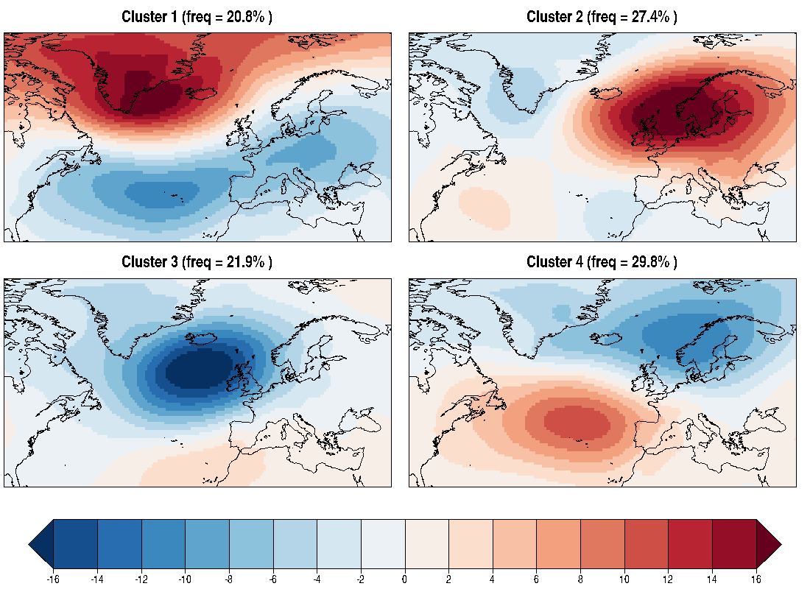
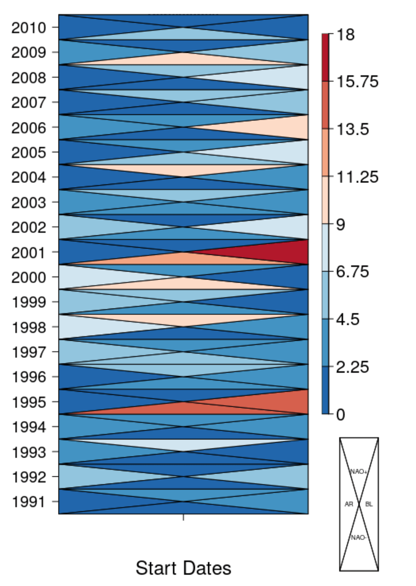
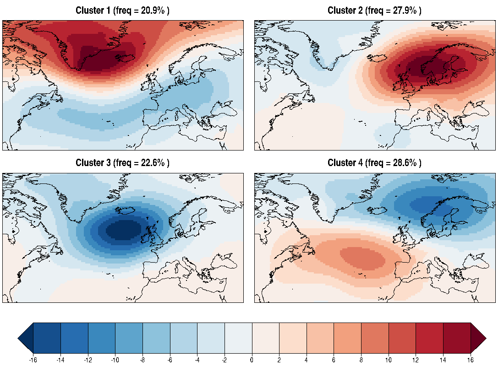

Weather regime analysis
========================

Weather regimes are a set of patterns able to characterize the different circulation structures occurring each month/season. This vignette aims to illustrate a step-by-step example of how to perform a weather regime assessment using CSTools functionalities.

### 1- Required packages 

The functions to compute the Weather Regimes are part of CSTools while plotting functions are included in s2dverification package:
 
```r
library(CSTools)
library(s2dverification)
library(zeallot)
```


### 2- Retrive data from files
 
The data employed in this example are described below.  
- Sea level pressure (psl): this has been selected as the circulation variable, however other variables such as geopotential at 500 hPa can be also used.
- Region: Euro-Atlantic domain [85.5ºW-45ºE; 27-81ºN].
- Datasets: seasonal predictions from ECMWF System 4 ([**Molteni et al. 2011**] (https://www.ecmwf.int/sites/default/files/elibrary/2011/11209-new-ecmwf-seasonal-forecast-system-system-4.pdf)) and ERA-Interim reanalysis ([**Dee et al. 2011**] (http://onlinelibrary.wiley.com/doi/10.1002/qj.828/pdf)) as a reference dataset.
- Period: 1991-2010. Only 20 years have been selected for illustrative purposes, but the full hindcast period could be used for the analysis.  


```r
sdates <- paste0(1991:2010, '1201')
c(exp, obs) %<-% CST_Load(var = 'psl', exp = 'system4_m1',
                          obs = 'erainterim',
                          sdates = sdates,
                          storefreq ='daily',
                          leadtimemin = 1, leadtimemax = 31,
                          latmin = 27, latmax = 81,
                          lonmin = 274.5, lonmax = 45, output = 'lonlat')
```


Notice that you need the files to be stored locally in your computer or server with correct configuration file. If you are interested into run this vignette, contact nuria.perez at bsc.es to get a data sample.

The objects returned by `CST_Load()` are s2v_cube class. They contains among others, the array with the requested data.


```r
> dim(exp$data)
dataset  member   sdate   ftime     lat     lon 
      1      15      20      31      77     186 
> dim(obs$data)
dataset  member   sdate   ftime     lat     lon 
      1       1      20      31      77     186
```


### 3- Daily anomalies based on a smoothed climatology)

The weather regimes classification is based on daily anomalies, which have been computed by following these steps: 


```r
c(ano_exp, ano_obs) %<-% CST_Anomaly(exp = exp, obs = obs, filter_span = 1)
```

The LOESS filter has been applied to the climatology to remove the short-term variability and retain the annual cycle. The parameter `loess_span` should be adapted to the length of the period used to compute the climatology (e.g. season, month, week,...). In this example we are using daily data, so we have selected `loess_span = 1`. 


### 4- Weather regimes in observations 

`CST_WeatherRegimes()` function is used to define the clusters based on the sea level pressure anomalies from ERA-Interim. This function is based on the [*kmeans function*] (http://stat.ethz.ch/R-manual/R-devel/library/stats/html/kmeans.html)
from the stats R package. In this example we have made different assumptions: four clusters (`ncenters=4`) will be produced and the Empirical orthogonal functions are not used to filter the data (`EOFS=FALSE`) just to take into account the extreme values. More details about the methodology can be found in Cortesi et al. 2018 (submitted). 


```r
WR_obs <- CST_WeatherRegimes(data = ano_obs, EOFs = FALSE, ncenters = 4)
``` 


`CST_WeatherRegime()` provides a s2dv_cube object with several elements. `$data` the 4 weather regimes composites are stored while `$statistics` contains extra information (`$pvalue`, `$cluster`, `$persistence` and `$frequency`) which are the needed parameters for the weather regimes assessment. Further details about the outputs provided by the `CST_WeatherRegime()` function can be found in the package documentation or typing `?CST_WeatherRegimes` in the R session. 


### 5- Visualisation of the observed weather regimes


To plot the composite maps of each regime and the mean frequencies of each cluster, we have employed the `PlotLayout()` and `PlotEquiMap()` functions available in s2dverifcation. The object `WR_obs$data` is divided by 100 to change from Pa to hPa. As the `WR_obs$statistics$frequency` provides the monthly frequencies, the climatological frequencies are obtained as the average across the 20 years of the monthly frequencies. Note that these frequencies could slightly change as a consequence of the randomness inherent to the iterative processes involved in the k-means.   

 ```r
clim_frequencies <- paste0('freq = ',
                         round(Mean1Dim(WR_obs$statistics$frequency, 1), 1), '%')
PlotLayout(PlotEquiMap, c(1, 2), lon = obs$lon, lat = obs$lat,
           var = WR_obs$data / 100,
           titles = paste0(paste0('Cluster ', 1:4), ' (', clim_frequencies,' )'),
           filled.continents = FALSE,
           axelab = FALSE, draw_separators = TRUE, subsampleg = 1,
           brks = seq(-16, 16, by = 2),
           bar_extra_labels = c(2, 0, 0, 0), fileout = './Figures/observed_regimes.png')
```



### 6- Visualisation of the observed regime persistence

Persistence measures the average number of days a regime lasts before evolving to a different regime. To plot regime persistence for each start date, we have employed the `PlotTriangles4Categories()` function available in CSTools.

```r
freq_obs <- WR_obs$statistics$persistence
freq_obs[is.na(freq_obs)] <- 0
dim(freq_obs) <- c(dimy = 20, dimcat = 4, dimx = 1)

PlotTriangles4Categories(freq_obs, toptitle = 'Persistence',
             xtitle = 'Start Dates', ytitle = '', xlab = FALSE,
             ylabels = substr(sdates, 1, 4), cex_leg = 0.6,
             lab_legend = c('AR', 'NAO-', 'BL', 'NAO+'), figure.width = .7)
      
```





### 7- Weather regimes in the predictions

Predicted anomalies for each day, month, member and lead time are matched with the observed clusters (obtained in step 4). The assignment of the anomalies to a pre-defined set of clusters guarantees that the predicted weather regimes have very similar spatial structures to the observed regimes, which is an essential requirement for the verification of weather regimes. This is an example of how to produce a set of weather regimes based on the predictions that can be verified with the observational dataset, but this approach can be also used in an operational context for which the probability of occurence of each cluster could be estimated. 


The matching is based on the minimization of Eucledian distance `method='distance'`, but it can also be also done in terms of spatial correlation `method='ACC'`. However the computational efficiency is superior for the distance method.


```r
WR_exp <- CST_RegimesAssign(data = ano_exp, ref_maps = WR_obs, method = 'distance', composite = TRUE, memb = TRUE)
```


`CST_RegimesAssign()` provides a object of 's2dv_cube' class which lists several elements. The composites are stored in the $data element which in the case of `memb = TRUE` corresponds to the mean composites for all member. `$pvalue`, `$cluster` and `$frequency` are stored in element `$statistics. This elements contain similar information to that provided by the `WeatherRegime()` function. Further details about the output can be found in the package documentation. 

### 8- Visualisation of the predicted weather regimes


The outputs of `RegimesAssign()` have been represented to be compared with those obtained for the observational classification (step 5). 


```r
PlotLayout(PlotEquiMap, c(1, 2),lon = exp$lon, lat = exp$lat,
           var = WR_exp$data/100, 
           titles = paste0(paste0('Cluster ',1:4), ' (',paste0('freq = ', 
                           round(WR_exp$statistics$frequency,1),'%'),' )'),
           filled.continents = FALSE,
           axelab = FALSE, draw_separators = TRUE,
           subsampleg = 1, brks = seq(-16, 16, by = 2),
           bar_extra_labels = c(2, 0, 0, 0), fileout = './Figures/predicted_regimes.png')
```



Observed and predicted weather regimes are very similar although their frequencies are slightly different. Cluster 1 is the Atlantic Ridge and cluster 3 the Blocking pattern, while cluster 4 and 2 are the positive and negative phases of the NAO. This patterns can change depending on the period analyzed.
